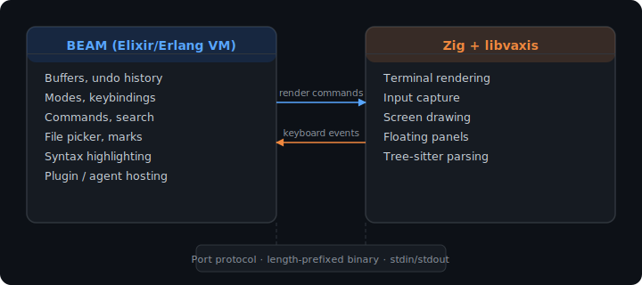

# 🥨 Minga

[Documentation](https://jsmestad.github.io/minga/) | [Configuration Guide](https://jsmestad.github.io/minga/configuration.html) | [Roadmap](ROADMAP.md)

**A modal text editor where every component is isolated, concurrent, and inspectable.**

AI coding agents are rewriting your files, spawning subprocesses, and racing against your keystrokes. Most editors bolt this on as an afterthought, hoping the single-threaded event loop can keep up. Minga was designed from the ground up with isolated processes that can't interfere with each other. Your typing never waits for a background task. An agent editing one file can't corrupt the buffer you're working in. And you can inspect any running component's state without stopping it.

Minga combines the modal editing of Neovim, the runtime flexibility of Emacs, and a modern architecture: **Elixir on the BEAM VM** for editor logic and **Zig** for terminal rendering. Vim users get the motions, operators, and text objects they think in. Emacs users get a living, mutable runtime where you can redefine commands, override keybindings, and customize any buffer's behavior, all without restarting. And unlike either, every component runs in its own isolated process with true preemptive concurrency.

## Why Minga?

### The problem with editors

Text editors are single-threaded programs with shared state. Every component (buffers, rendering, input handling, plugins, AI agents) contends for one event loop. When a background task does heavy work, your keystrokes queue up. When two things try to modify the same buffer, you get race conditions. When you want to know what a plugin is actually doing, you add `print` statements and restart.

These problems get worse as editors take on more concurrent workloads: LSP servers, formatters, AI agents, file watchers, git operations. The single-threaded architecture that worked for one human typing sequentially doesn't hold up when a dozen things want to happen at once.

### What if every component ran independently?

Minga runs as **two OS processes** with full isolation between components:

<p align="center">
  
</p>

The Erlang VM (the BEAM) was designed to run millions of lightweight processes with preemptive scheduling and no shared memory. Each buffer is its own process. The editor, the port manager, the LSP clients: all separate processes that communicate through message passing. The BEAM's scheduler guarantees every process gets CPU time, so your typing is always responsive regardless of what else is happening. This isn't async with callbacks. It's true preemptive concurrency with fairness guarantees enforced by the VM.

This architecture was battle-tested in telecom, banking, and messaging infrastructure for 30+ years before Minga pointed it at a text editor.

### Why hasn't anyone done this before?

Because the BEAM doesn't talk to terminals. It's a server-side VM, great at concurrency but terrible at drawing characters on your screen. So Minga doesn't try. It delegates rendering to a Zig binary compiled against [libvaxis](https://github.com/rockorager/libvaxis), a modern terminal UI library. Zero NIFs. Zero shared memory. Just a clean binary protocol between two processes that each do what they're best at.

## Features

Minga aims to bring the best of modern modal editing together:

- **Vim-style modal editing:** Normal, Insert, Visual, Operator-Pending, Replace, and Search modes with the motions and operators you already know (`d`, `c`, `y`, `w`, `b`, `e`, `iw`, `i"`, `a{`, and many more)
- **Space-leader keybindings:** organized mnemonic commands behind `SPC`: `SPC f f` to find files, `SPC b b` to switch buffers, `SPC s p` to search your project. Discoverable via Which-Key popup that shows you what's available as you type
- **Tree-sitter syntax highlighting:** 24 languages compiled in (Elixir, Ruby, TypeScript, Go, Rust, Python, Zig, and more), with user-overridable highlight queries
- **Fuzzy file finder and buffer switcher:** built-in pickers with incremental search
- **Persistent undo:** your undo history survives buffer switches
- **Isolated by design:** every component is its own process. Buffers, plugins, agents, and the renderer can't interfere with each other, and if one fails, the rest keep running
- **Built for the agentic era:** AI coding agents need true concurrency, serialized buffer access, and observable state. Minga's process model provides all three natively (see [Architecture](docs/ARCHITECTURE.md))

### Current status

🚧 **Early development.** Minga is usable for editing but is not yet a daily driver. Core editing, navigation, and syntax highlighting work. We're building toward split windows, LSP support, and a plugin system.

See the [Roadmap](ROADMAP.md) for the full feature grid and what's coming next. If you want to help shape what a BEAM-powered editor can be, now is a great time to jump in.

## Quick start

### Prerequisites

- **[asdf](https://asdf-vm.com/)** (or compatible version manager) — Minga pins exact tool versions in `.tool-versions`. Install asdf and the required plugins, then run `asdf install` from the repo root to get the correct versions of everything:
  - Erlang/OTP 28+
  - Elixir 1.19+
  - Zig 0.15+

### Build & run

```bash
# Clone and install toolchain
git clone https://github.com/jsmestad/minga.git
cd minga
asdf install               # Installs Erlang, Elixir, and Zig from .tool-versions

# Build
mix deps.get
mix compile                # Builds both Elixir and Zig

# Run tests
mix test                       # 1,393 Elixir tests
cd zig && zig build test       # 105 Zig tests

# Launch
bin/minga                  # Empty buffer
bin/minga path/to/file     # Open a file
```

### Now what?

Minga uses **Vim-style modal editing**. You start in Normal mode — press `i` to enter Insert mode and type, `Esc` to go back to Normal.

Press **`Space`** in Normal mode to open the **Which-Key** popup, a discoverable menu of every leader command grouped by category (`f` → file, `b` → buffer, `w` → window, etc.). Start there to explore what's available.

A few essentials to get you going:

| Keys | Action |
|------|--------|
| `i` / `Esc` | Enter Insert mode / back to Normal |
| `SPC f s` | Save file |
| `SPC f f` | Find file |
| `SPC b b` | Switch buffer |
| `SPC q q` | Quit |
| `:w` / `:q` | Save / quit (Vim-style commands work too) |

See the [Roadmap](ROADMAP.md) for the full feature grid and what's implemented, and the [Architecture](docs/ARCHITECTURE.md) doc if you want to understand how the pieces fit together.

## Architecture deep dive

For the curious, here's what makes Minga tick:

| Layer | Technology | Responsibility |
|-------|-----------|----------------|
| **Editor core** | Elixir on the BEAM | Gap buffer, modes, motions, operators, text objects, keymap trie, command registry, undo/redo, syntax highlight orchestration |
| **Renderer** | Zig + libvaxis | Terminal drawing, keyboard input, tree-sitter parsing, floating panels |
| **Protocol** | Length-prefixed binary over stdin/stdout | Typed opcodes for render commands (BEAM→Zig) and input events (Zig→BEAM) |
| **Supervision** | OTP supervisor tree | Process lifecycle management with automatic recovery of failed components |

The BEAM side is a set of GenServers (one per buffer, one for the editor orchestrator, one for the port manager) all supervised. The Zig side is a single-threaded event loop that reads port commands, renders frames, and forwards keyboard input. Tree-sitter runs in the Zig process with pre-compiled queries for instant highlighting on file open.

## Coming from another editor?

- **[For AI-assisted developers](docs/FOR-AI-CODERS.md):** Using Claude Code, Cursor, Copilot, or Aider? Your editor wasn't designed for concurrent autonomous agents. Minga was.
- **[For Neovim users](docs/FOR-NEOVIM-USERS.md):** Same modal editing, better runtime. Why the BEAM solves problems Neovim can't fix without a rewrite.
- **[For Emacs users](docs/FOR-EMACS-USERS.md):** Same depth of customization, none of the single-threaded pain. Elixir is Minga's Elisp.

## Contributing

Minga is open to contributions! See [CONTRIBUTING.md](CONTRIBUTING.md) for setup, testing, and how to add new commands, motions, and render features.

```bash
# Before committing
mix lint                          # Format + Credo + compile warnings
mix test --warnings-as-errors     # Tests
mix dialyzer                      # Typespec consistency
```

## License

MIT

## Acknowledgements

A heartfelt thank you to [Henrik Lissner](https://github.com/hlissner) and all contributors to [Doom Emacs](https://github.com/doomemacs/doomemacs). Its keybinding design, leader-key UX, and relentless focus on making a powerful editor feel fast and discoverable were a direct inspiration for Minga's command model.

---

*Created by [Justin Smestad](https://evalcode.com). Built with 🥨 in Colorado.*
