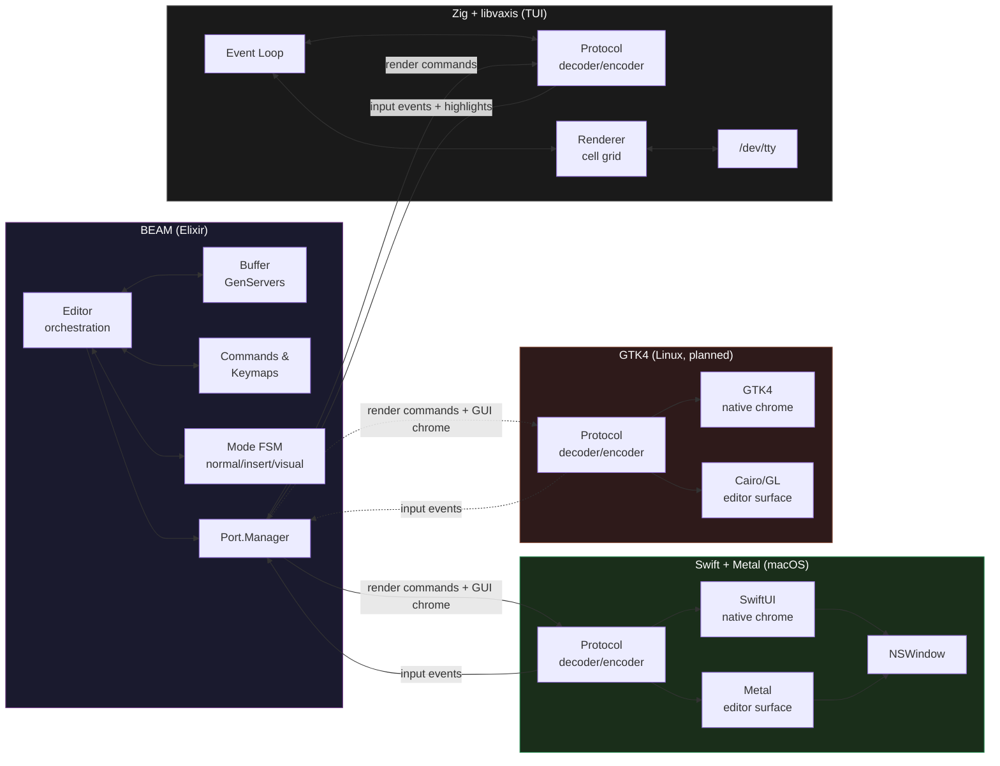
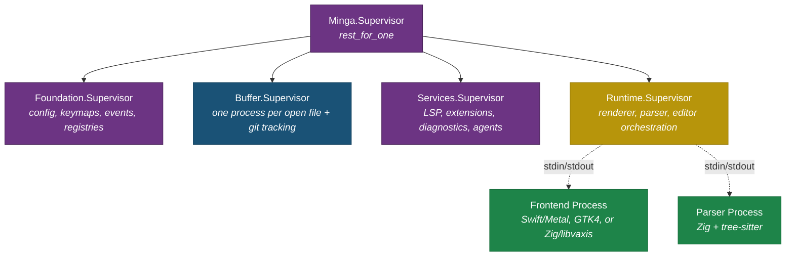
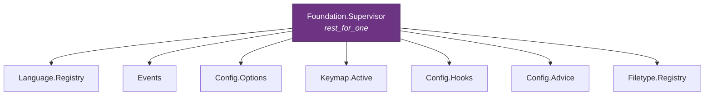
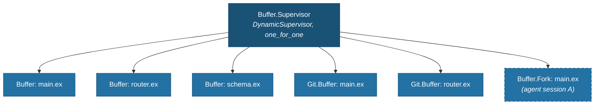
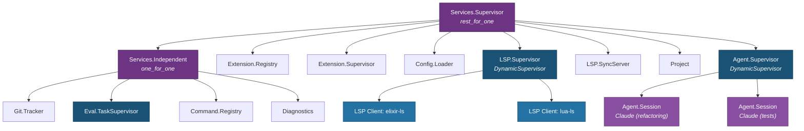
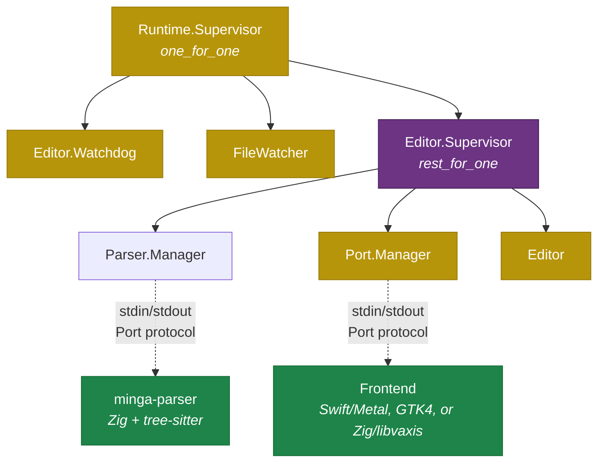
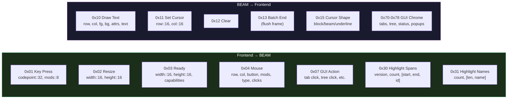
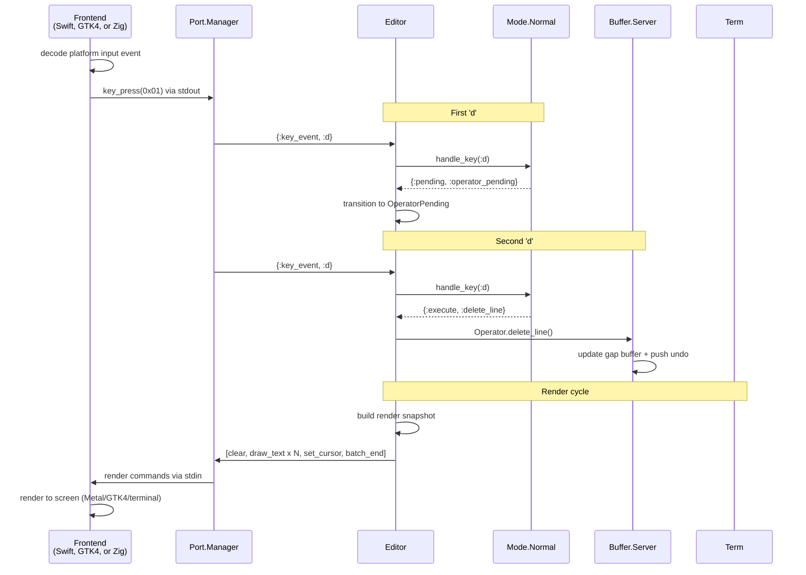
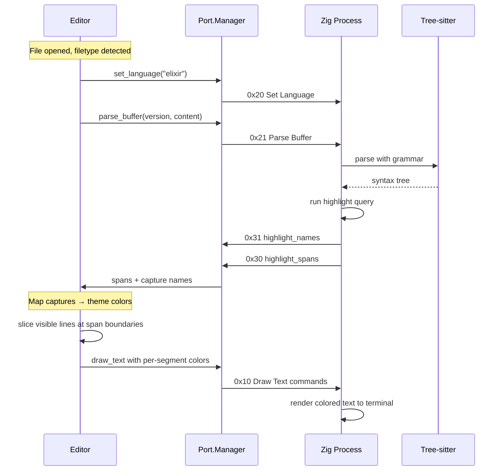
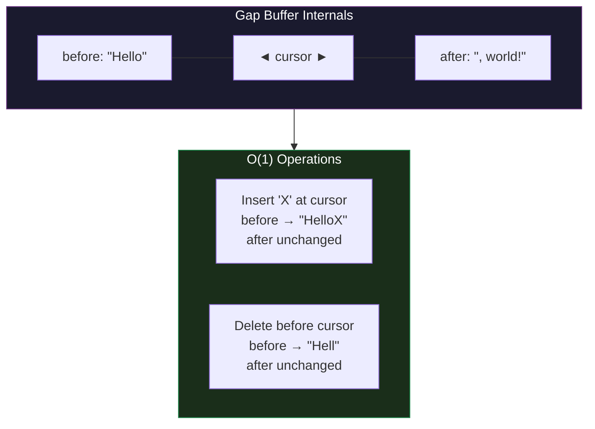

# Minga Architecture

How a text editor built on process isolation and preemptive concurrency actually works.

---

## The Big Idea

Most editors are single-threaded with shared state. Everything (buffers, rendering, input, plugins, AI agents) lives in one address space, contending for one event loop. When a background task does heavy work, your keystrokes queue up. When two things modify the same buffer, you get race conditions.

Minga splits the editor into **separate OS processes** with completely isolated memory: a BEAM process for all editor logic, and one or more frontend processes for rendering and input.



All frontends communicate with the BEAM over the same binary protocol on stdin/stdout. They share no memory. The BEAM is the single source of truth for all editor state; frontends are "dumb" renderers and input sources. Every internal component (each buffer, the editor, the port manager, each future plugin) runs as its own lightweight BEAM process with its own state. They can't interfere with each other because the VM enforces the boundaries.

This isn't a workaround for a limitation. It's the whole point.

---

## Why the BEAM?

The Erlang VM (BEAM) was designed in the 1980s to run telephone switches: systems serving millions of concurrent connections that must stay responsive under load. Its design priorities map directly onto what a modern editor needs but has never had.

### Structural isolation through processes

Every buffer in Minga is its own BEAM process (a GenServer). Processes don't share memory. A buffer's state is only ever accessed by that buffer's process. Period.

```
Buffer.Supervisor (DynamicSupervisor, one_for_one)
├── Buffer "main.ex"     ← owns its own state
├── Buffer "router.ex"   ← completely independent memory
└── Buffer "schema.ex"   ← completely independent memory
```

This eliminates an entire class of bugs: data races, torn reads, iterator invalidation. When an AI agent edits line 200 of a file while you're typing on line 50, there's no race condition. Both edits arrive as messages to the buffer's GenServer, which processes them sequentially and atomically. The buffer's mailbox serializes all access naturally.

In a traditional editor, two things modifying the same buffer is a concurrency hazard. In Minga, it's just two messages in a queue.

### True preemptive concurrency

This is the strongest technical differentiator. The BEAM runs a preemptive scheduler with reduction counting that guarantees every process gets fair CPU time. Your keystroke handling is a process. LSP communication is a process. An AI agent is a process. The scheduler ensures none of them can starve the others.

This is qualitatively different from async/await or event loops. In Neovim, VS Code's extension host, or Emacs, "async" means cooperative multitasking: one thing runs at a time, and if it takes too long, everything else waits. The BEAM's scheduler preempts processes after a fixed number of reductions (roughly, function calls) regardless of whether they yield voluntarily.

The practical result: your typing is always responsive. Not because of careful async engineering, but because the VM enforces it at the scheduler level.

### Message passing over shared state

The Editor process never directly touches buffer memory. It sends messages:

```elixir
# Editor asks the buffer for its content
{content, cursor} = Buffer.Server.content_and_cursor(buffer_pid)

# Buffer process handles this in isolation
def handle_call(:content_and_cursor, _from, state) do
  {:reply, {Document.content(state.document), Document.cursor(state.document)}, state}
end
```

No locks. No mutexes. No "file changed on disk" dialogs. Just processes with private state communicating through well-defined messages.

### Per-process garbage collection

Each BEAM process has its own heap and its own garbage collector. When a buffer process GCs, it doesn't pause the editor or the renderer. A large file's buffer can collect its garbage without affecting the responsiveness of a small file you're actively editing.

Traditional editors in GC'd languages (VS Code/Electron, editors in Java or Go) have global GC pauses that cause visible input latency spikes. The BEAM's per-process GC eliminates this entirely.

### Supervision: graceful degradation

BEAM processes are organized into supervision trees that encode dependency relationships. When a component fails, its supervisor can restart it without affecting unrelated components.

### High-level overview

The top-level supervisor splits the system into four tiers. Each tier is isolated so that a crash in one doesn't cascade into the others. `rest_for_one` means tiers restart in order: if Foundation restarts, everything below it restarts too (they depend on config and events). But a crash in Runtime doesn't touch Services, Buffers, or Foundation.



### Foundation tier

Stateless registries and configuration that everything else depends on. These rarely fail.



### Buffer tier

One process per open file, plus per-buffer git tracking. `one_for_one` means each buffer is independent: one buffer crashing doesn't affect any other.



> **Note:** `Buffer.Fork` processes (dashed border) are planned. See [Buffer-Aware Agents](BUFFER-AWARE-AGENTS.md#phase-2-buffer-forking-with-three-way-merge).

### Services tier

Higher-level features that depend on Foundation and Buffers but are independent of the renderer. A git tracking crash restarts only Git.Tracker. An LSP server crash restarts only that client.



### Runtime tier

The tightly-coupled trio that handles rendering and user interaction. `rest_for_one` means if the Port Manager (renderer) fails, the Editor restarts too since it depends on the renderer. But buffers are untouched: your undo history, cursor positions, and unsaved changes are all preserved.



### Why this structure matters

The nested supervisors constrain blast radius. Losing your LSP connection doesn't affect editing. A plugin error doesn't corrupt your buffers. A filesystem watcher flake restarts only FileWatcher, not the renderer. The `rest_for_one` chains within Foundation and Services preserve real dependency ordering (Events → Config subscribers, Extension.Registry → Config.Loader) while preventing unrelated siblings from cascading into each other.

The system degrades in pieces rather than failing all at once. The BEAM was designed for telecom systems that run for years without downtime. The same supervision engineering applies here.

---

## Why Native Frontends?

The BEAM is excellent at concurrency and isolation. It is terrible at putting pixels on screen. It has no concept of terminal modes, GPU rendering, or native window systems. Minga solves this by running frontends as separate OS processes that communicate with the BEAM over a binary protocol.

### Platform-native rendering (GUI-first)

Minga's primary frontends use platform-native toolkits for the best possible user experience:

- **macOS: Swift + Metal.** SwiftUI renders chrome (tab bar, file tree, status bar, popups) as native views. Metal renders the editor text surface with GPU-accelerated glyph rasterization via CoreText. This gives macOS users native scrolling, system fonts, trackpad gestures, and full accessibility support.
- **Linux: GTK4 (planned).** GTK4 widgets for chrome, Cairo or OpenGL for the text surface. Native Wayland/X11 integration, IME support, system theming.
- **TUI: Zig + libvaxis.** For terminal users. [libvaxis](https://github.com/rockorager/libvaxis) handles terminal differences, Unicode width calculation, and cell-level diffing.

Each frontend is a "dumb" renderer: it reads binary commands from stdin, draws them, and writes input events back to stdout. All intelligence lives in the BEAM.

### Why Zig for the TUI and parser?

Zig fills two roles: the TUI terminal renderer and the tree-sitter parser process. It's a good fit for both because:

- **Compiles C natively:** tree-sitter grammars (written in C) compile as part of the Zig build with zero FFI overhead
- **No hidden allocations:** important for the parser's memory-sensitive hot loop
- **Single binary output:** no dynamic linking, no runtime dependencies

### Why not a NIF?

NIFs (Native Implemented Functions) run inside the BEAM process. A failure in a NIF takes down the entire Erlang VM: every buffer, every process, everything. This directly contradicts Minga's isolation model.

A Port is an OS-level process boundary. A frontend can crash completely, and the BEAM keeps running. The supervisor detects the Port died, restarts the Port Manager, and the Editor re-renders. Your data stays intact because it lives in completely separate processes.

---

## The Port Protocol

BEAM and the frontend communicate via `{:packet, 4}`: each message is prefixed with a 4-byte big-endian length, followed by a 1-byte opcode and opcode-specific binary fields. This is a simple, fast, zero-copy-friendly wire format.

Every render frame follows the pattern: `clear` → N × `draw_text` → `set_cursor` → `set_cursor_shape` → `batch_end`. The frontend double-buffers and only writes changed cells to the terminal (TUI) or triggers a display refresh (GUI).

The protocol has 20+ opcodes covering rendering, input, syntax highlighting, and diagnostics:



For the full specification with byte-level field descriptions, sequencing rules, and implementation guidance, see **[docs/PROTOCOL.md](PROTOCOL.md)**. For the GUI chrome opcodes sent only to native frontends (SwiftUI, GTK4), see **[docs/GUI_PROTOCOL.md](GUI_PROTOCOL.md)**.

Any process that implements the `Minga.Port.Frontend` behaviour (see `lib/minga/port/frontend.ex`) and speaks this protocol can serve as a Minga rendering backend. The macOS Swift frontend and Zig TUI are the current implementations; a GTK4 Linux frontend is planned.

### Display List (Rendering IR)

The BEAM side owns a **display list** of styled text runs that sits between editor state and protocol encoding. This intermediate representation is the single source of truth for "what's on screen" and is consumed by all frontends (macOS GUI, Linux GUI, TUI).

The display list uses **styled text runs**, not a cell grid. A cell grid is terminal-shaped and would force GUI frontends to fake a terminal. Styled text runs stay line-and-column based (monospaced editing model) while being abstract enough for both TUI and GUI frontends:

```elixir
# A styled run: "draw this text in this style starting at this column"
@type text_run :: {col :: non_neg_integer(), text :: String.t(), style :: style()}

# A line's visual content: a list of runs
@type display_line :: [text_run()]

# A window's frame: positioned rectangle with visible lines
@type window_frame :: %{
  rect: rect(),
  lines: %{row :: non_neg_integer() => display_line()},
  gutter: %{row :: non_neg_integer() => display_line()},
  cursor: {row :: non_neg_integer(), col :: non_neg_integer()}
}
```

Each frontend does the last-mile translation. The macOS GUI converts text runs into CoreText attributed strings drawn on a Metal surface at pixel positions derived from the font metrics. The TUI frontend converts text runs into terminal cells (a run `{5, "hello", green}` becomes five green cells at columns 5-9). The IR doesn't change; only the frontend's interpretation does.

GUI frontends also receive **structured chrome data** (opcodes 0x70-0x78) for native UI elements: tab bars, file trees, status bars, which-key popups, completion menus, and agent chat views. These are rendered as platform-native widgets (SwiftUI views, GTK4 widgets) rather than painted as cells. See **[docs/GUI_PROTOCOL.md](GUI_PROTOCOL.md)** for the full specification.

This design also supports variable-width font rendering in GUI frontends. The IR uses character offsets, not pixel positions. A monospaced frontend multiplies by cell width; a proportional frontend measures the preceding characters to find the pixel X. The `measure_text` / `text_width` protocol opcodes handle the cases where the BEAM needs to query the frontend for precise measurements.

---

## Life of a Keystroke

Here's what happens when you press `dd` (delete a line) in normal mode. The entire round-trip takes under 1ms on the BEAM side.



### Keymap Scopes

Different views need different keybindings. The agentic chat view repurposes `j`/`k` for scrolling, the file tree uses `h`/`l` for collapse/expand, and the normal editor uses the full vim mode FSM. Rather than maintaining parallel focus stack handlers that manually pass keys through to the mode system, Minga uses **keymap scopes** to declare view-specific bindings as trie data.

```
Keystroke arrives
    │
    ▼
Input.Scoped checks keymap_scope on EditorState
    │
    ├─ :editor → passthrough (vim mode FSM handles everything)
    ├─ :agent  → resolve through Scope.Agent trie
    │     ├─ Found → execute command
    │     ├─ Prefix → store node, wait for next key
    │     └─ Not found → swallow (agent owns all keys)
    └─ :file_tree → resolve through Scope.FileTree trie
          ├─ Found → execute command
          └─ Not found → passthrough (vim mode FSM via buffer swap)
```

Each scope module implements the `Minga.Keymap.Scope` behaviour, declaring its keybindings as trie nodes per vim state (normal, insert). The `Input.Scoped` handler sits in the focus stack above the mode FSM and routes keys through the active scope before falling through to vim navigation.

Scopes are Minga's equivalent of Emacs major modes. A buffer's scope determines which keys are active, the same way `python-mode` or `magit-status-mode` provide buffer-type-specific keymaps in Emacs.

---

### Mouse Event Routing

Mouse events flow through the same focus stack as keyboard input, but with a key difference: **mouse routing is position-based, not scope-based.** Keyboard input routes through `keymap_scope` (which pane has focus). Mouse input routes by hit-testing the cursor position against `Layout.get(state)` rects (where on screen did the event happen). This means scrolling over the agent chat scrolls the chat regardless of which pane has keyboard focus.

Both the Zig TUI and the Swift GUI encode mouse events as 9-byte `mouse_event` messages (opcode `0x04`) containing row, col, button, modifiers, event type, and click count. The BEAM decodes them in `Port.Protocol` and dispatches through `Input.Router.dispatch_mouse/7`, which walks the focus stack calling `handle_mouse/7` on each handler that implements it.

```
Mouse event arrives (9 bytes: opcode + row + col + button + mods + event_type + click_count)
    │
    ▼
Editor.handle_info decodes via Port.Protocol
    │
    ▼
Input.Router.dispatch_mouse walks overlay handlers, then surface handlers
    │
    ├─ Overlays (Picker, Completion) - intercept when their UI is visible
    │
    ├─ Input.FileTreeHandler - hit-tests against Layout.file_tree rect
    │     ├─ Inside file tree → handle tree click/scroll
    │     └─ Outside → :passthrough
    │
    ├─ Input.AgentMouse - hit-tests against agent regions (position-based)
    │     ├─ Agent chat window (WindowTree + Content.agent_chat?) → scroll chat, click-to-focus
    │     ├─ Agent side panel (Layout.agent_panel rect) → scroll chat, click-to-focus
    │     ├─ File viewer sidebar (right of chat_width_pct) → scroll preview
    │     └─ Outside agent regions → :passthrough
    │
    └─ Input.ModeFSM (fallback) - buffer-content mouse handling
          └─ Editor.Mouse.handle/7
                ├─ click_count=1 → position cursor, start drag
                ├─ click_count=2 → select word (visual char), word-snapped drag
                ├─ click_count=3 → select line (visual line), line-snapped drag
                ├─ Shift+click  → extend visual selection
                ├─ Cmd/Ctrl+click → :goto_definition
                ├─ Middle click → paste register at position
                └─ Wheel left/right → horizontal viewport scroll
```

Each content-type handler is responsible for its own region. `Editor.Mouse` handles only buffer content; it has no knowledge of agent panels, file trees, or other content types. This follows the same principle as keyboard dispatch: the editing model produces commands, and each content type interprets them against its own data model.

Multi-click detection works differently per frontend. The GUI sends `NSEvent.clickCount` directly in the protocol, so the BEAM trusts the native OS timing. The TUI sends `click_count=1` and the BEAM's `State.Mouse.record_press/4` detects multi-clicks using a timing window and position threshold, cycling 1 → 2 → 3 → 1.

The `handle_mouse/7` callback is optional on `Input.Handler`. Handlers that don't implement it are skipped during the focus stack walk. This keeps keyboard-only handlers (like `Completion` or `Picker`) simple until they need mouse support.

---

## Syntax Highlighting Pipeline

Tree-sitter parsing runs in the Zig process to avoid sending parse trees across the protocol boundary. The BEAM controls *what* to parse and *how* to color it; Zig does the actual parsing.



All 39 grammars are compiled into the Zig binary. Highlight queries are embedded via `@embedFile` and pre-compiled on a background thread at startup. First-file highlighting appears in ~16ms.

Users can override queries by placing `.scm` files in `~/.config/minga/queries/{lang}/highlights.scm`.

---

## Buffer Architecture

Each buffer is a GenServer wrapping a gap buffer, the classic data structure used by Emacs since the 1980s. Text is stored as two binaries with a "gap" at the cursor position. Insertions and deletions at the cursor are O(1). Only the text on one side of the gap changes. Moving the cursor is O(k) where k is the distance moved, but since most movements are small (next word, next line), this is fast in practice.



### Byte-indexed positions

All positions in Minga are `{line, byte_col}`, byte offsets within a line, not grapheme indices. This was a deliberate choice:

- **O(1) string slicing:** `binary_part/3` with byte offsets is a direct pointer operation. Grapheme indexing requires O(n) scanning.
- **Tree-sitter alignment:** tree-sitter returns byte offsets natively. No conversion needed for syntax highlighting.
- **ASCII fast path:** for ASCII text (>95% of code), byte offset equals grapheme index. Zero overhead for the common case.

Grapheme conversion happens only at the **render boundary**, when converting cursor position to screen column. This runs only for visible lines (~40–50 per frame), which is negligible.

---

## Git Integration

Git awareness runs as a lightweight per-buffer process (`Minga.Git.Buffer`) under `Buffer.Supervisor`. When the editor opens a file that lives inside a git repository, it spawns a `Git.Buffer` that:

1. Detects the git root via `git rev-parse --show-toplevel`
2. Fetches the HEAD version of the file via `git show HEAD:<path>`
3. Splits both the HEAD version and current buffer content into lines
4. Diffs them in pure Elixir using `List.myers_difference/2` (no external process needed)
5. Produces a hunk list and a sign map (line number → `:added` | `:modified` | `:deleted`)

The sign map feeds the gutter renderer. Each line gets a 2-character sign column showing `▎` for added/modified lines and `▁` for deleted lines. Diagnostic signs (errors, warnings) take priority on the same line.

This design avoids shelling out to `git diff` on every keystroke. The diff runs entirely in-memory against cached base content. The only git commands happen at buffer open (to fetch HEAD content) and on explicit stage operations. This matters for AI agent scenarios where edits arrive in rapid bursts.

When a hunk is staged, the `Git.Buffer` re-fetches HEAD content to rebase its diff. Reverting a hunk splices the original lines back into the buffer content.

The `Git.Buffer` processes are supervised under `Buffer.Supervisor` alongside the buffer processes themselves. If a git buffer crashes, it doesn't affect editing. The gutter simply stops showing signs for that buffer until the process restarts.

---

## What This Enables

The two-process, isolation-based architecture isn't just about resilience. It opens up possibilities that traditional editors can't easily achieve:

### Runtime customization: the Emacs inheritance

One of the most powerful things about Emacs is that it's a living, mutable environment. You can change any behavior at runtime (redefine a function, tweak a variable, override a keybinding) and the editor adapts immediately without restarting. This is what makes Emacs endlessly customizable: the editor isn't a fixed binary, it's a runtime you reshape while you use it.

Minga inherits this philosophy through the BEAM. Every component in the editor is a running process with mutable state. You can reach into any process and change its behavior at runtime, not by patching global variables, but by sending it a message that updates its state.

**This is the key insight: BEAM processes are living, isolated environments with their own state.** Each buffer process carries its own configuration. You don't need a global settings dictionary with special "buffer-local override" lookup chains. You just change the state inside that buffer's process. Global config stays untouched. Other buffers stay untouched.

```elixir
# Change tab size for just this one buffer, at runtime
Buffer.Server.set_option(buffer_pid, :tab_size, 2)

# The buffer process updates its own state. That's it.
# No global config mutated. No other buffers affected.
def handle_call({:set_option, key, value}, _from, state) do
  {:reply, :ok, put_in(state.options[key], value)}
end
```

This maps directly to how Emacs buffer-local variables work, but with stronger guarantees. In Emacs, buffer-local variables are a layer on top of a global symbol table, and the interaction between `setq`, `setq-local`, `make-local-variable`, and `default-value` is notoriously confusing. In Minga, the separation is structural: each process *is* its own namespace. There's no mechanism for one buffer to accidentally mutate another's state because processes don't share memory. The isolation isn't a convention you have to follow. It's enforced by the VM.

The natural resolution order for any setting:

```
Buffer.Server state     (highest priority: runtime overrides for this buffer)
    ▼ falls through to
Filetype defaults       (conventions, e.g. Go uses tabs, Python uses 4 spaces)
    ▼ falls through to
Editor global defaults  (user's base config: tab_size, theme, scroll_off)
```

Each layer lives in a different process. Setting a buffer-local override is a message to that buffer's GenServer. Setting a filetype default updates the Filetype.Registry process. Changing a global default updates the Editor process. No locks, no synchronization, no invalidation callbacks. Just processes with state and a clear lookup order.

This extends beyond simple options. Keybindings, mode behavior, auto-pair rules, highlight themes: anything that lives in process state can be customized per-buffer at runtime. Open a Markdown file and want different keybindings? That buffer's process holds its own keymap overlay. Working in a monorepo where one subdirectory uses different formatting? Those buffers carry their own formatter config. The process model makes "buffer-local everything" the default architecture, not a special case bolted on later.

And because the BEAM supports hot code reloading, the customization story goes even deeper: you can redefine *functions* at runtime, not just data. Load a new module, replace a motion implementation, add a command, in a running editor, without restarting. This is the same capability that lets Erlang telecom systems upgrade without dropping calls. In Minga, it means your editor is as malleable as Emacs, but with process isolation that Emacs Lisp never had.

### Hot code reloading

The BEAM supports replacing running code without restarting the VM. In the future, Minga could update its editor logic, add new commands, or fix bugs in a running session without closing files or losing state.

### Distributed editing

BEAM processes can communicate across machines transparently. Two Minga instances could theoretically share buffers over the network using the same GenServer protocol they use locally. This is how Erlang was designed to work.

### Plugin isolation

Future plugins will run as supervised BEAM processes. A misbehaving plugin is confined to its own process tree. It can't corrupt buffer state, block your input handling, or interfere with other plugins, because it doesn't share memory with any of them. If it fails, its supervisor restarts it and you see an error message instead of a degraded editing experience.

### Agentic AI integration

AI coding agents (tools like Claude Code, Cursor, Aider, and Copilot) work by spawning external processes: LLM API calls, shell commands, file rewrites, tool invocations. These processes are inherently unpredictable. API calls time out. Shell commands hang. File operations conflict with what you're editing. An agent might try to write to a buffer you're actively modifying.

In a traditional editor, these workloads fight for the same event loop as your typing. A long-running API call can cause UI jank. Concurrent buffer modifications create race conditions. And you have limited visibility into what the agent is actually doing at any moment.

Minga's architecture was *designed* for exactly this kind of workload:

- **Each agent session runs as its own supervised process tree.** ✅ Agents are isolated from your buffers, from each other, and from the editor core. They communicate through the same message-passing interface the editor itself uses.

- **The BEAM's preemptive scheduler prevents starvation.** ✅ A long-running agent can't cause UI jank. The scheduler guarantees every process gets CPU time, regardless of what any single process is doing. You keep editing while the agent works in the background, not because of careful async engineering, but because the VM enforces it at the scheduler level.

- **Process monitoring enables real-time observability.** ✅ The editor monitors agent processes and reflects their status in the UI: running, waiting for API response, applying changes, failed. You can inspect an agent's state with `:sys.get_state(agent_pid)` without stopping it.

- **Concurrent agents are free.** ✅ Want to run a code review agent on one buffer while a refactoring agent works on another? Those are just processes. The BEAM was built to run millions of them. There's no thread pool to tune, no async runtime to configure, no event loop to worry about blocking.

- **Buffer access goes through message passing.** (Planned) The architecture enables this: an agent process sends a message to a buffer's GenServer, which processes the edit atomically and pushes an undo entry. Today, agent tools bypass this and write directly to the filesystem via `File.read/write`. The batch edit API (`Buffer.Server.apply_text_edits/2`) and incremental sync infrastructure (`EditDelta`) already exist; the agent tools just need to be wired to use them. See [Buffer-Aware Agents](BUFFER-AWARE-AGENTS.md) for the full design.

- **Buffer forking for concurrent agents.** (Planned) Each agent session will get its own in-memory fork of the document, enabling truly concurrent editing without filesystem-level conflicts. Forks merge back via three-way merge, with the existing diff review UI for conflict resolution. See [Buffer-Aware Agents](BUFFER-AWARE-AGENTS.md#phase-2-buffer-forking-with-three-way-merge).

Most editors are trying to retrofit agent support onto architectures that assumed a single human operator making sequential edits. Minga's process model treats "external thing wants to modify a buffer" as a first-class operation, because that's literally how the editor itself works internally. The [buffer-aware agents](BUFFER-AWARE-AGENTS.md) roadmap closes the remaining gap between what the architecture enables and what the agent tools actually use.

### Concurrent background work

LSP communication, file indexing, git operations: these can run as separate BEAM processes without blocking the editor. The BEAM's preemptive scheduler ensures no single process can starve the UI, even under heavy load. This is qualitatively different from async/await in single-threaded runtimes. It's true preemptive concurrency with fairness guarantees.

---

## GUI/TUI Command Branching

Commands that open GUI-native chrome (bottom panel, native pickers, native tooltips) need a TUI fallback that does something reasonable with the TUI's tools (gap buffers, popup windows, cell-grid overlays). The branching uses `Capabilities.gui?` at runtime since the frontend type isn't known at compile time.

**Established pattern:** follow the Chrome module's approach. `Chrome` dispatches to `Chrome.TUI` / `Chrome.GUI` submodules. Command modules with GUI/TUI branches use `Commands.Foo.GUI` and `Commands.Foo.TUI` submodules with a `Frontend` behaviour and a single dispatch in the parent. Already implemented in `Commands.UI` and `Commands.BufferManagement`. For simpler cases with 1-2 branches that don't warrant submodules, inline `if Capabilities.gui?` checks are acceptable.

```
lib/minga/editor/commands/
  buffer_management.ex          # shared commands + dispatch
  buffer_management/gui.ex      # GUI-specific (bottom panel, native UI)
  buffer_management/tui.ex      # TUI-specific (gap buffers, popups)
```

The dispatch helper lives in the parent module (not a shared utility), since each command group may dispatch on different capabilities.

---

## Design Principles

These guide what we build and how:

- **GUI-first, TUI-capable.** Design for native GUI frontends (Swift/Metal, GTK4) first. The TUI is a capable fallback, like Emacs's terminal mode, not the primary target.
- **Fault tolerance over speed.** The BEAM's supervision model means crashes are recoverable events, not catastrophes.
- **Process isolation.** Editor state and rendering never share memory; either can fail independently. Multiple frontends can exist because the protocol enforces this boundary.
- **Vim grammar, modern UX.** Modal editing with discoverable leader-key menus.
- **Elixir for logic, platform-native rendering.** The BEAM handles everything a text editor needs to think about. Swift, GTK4, and Zig handle everything a display needs to draw.
- **Test everything.** Property-based tests for data structures, snapshot tests for UI, integration tests for the full pipeline.
- **Convention over configuration.** Minga ships working defaults for everything: theme, keybindings, tab width, formatters, LSP servers. A fresh install with no config file should feel like Doom Emacs on day one. Your `config.exs` is a diff, not a manifest; it contains only what you've changed. Defaults are inspectable (`:set` shows current values, `SPC h k` shows bindings and whether they're defaults or overrides) and never hidden so deep that users can't find them.
- **Core vs. extension.** If a Doom Emacs user installs Minga with zero configuration, would they expect this feature to work? If yes, it ships built-in. If it's a power-user addition, a niche workflow, or a matter of taste, it's an extension. Built-in features that touch only public APIs should be architected as if they were extensions (clean boundary, no internal coupling) so extraction is possible later. See `docs/AUTHORING_EXTENSIONS.md` for the full philosophy.

---

## Trade-offs

Honest accounting of what this architecture costs:

| Trade-off | Why we accept it |
|-----------|-----------------|
| **Serialization overhead** (every render frame crosses a process boundary) | The protocol is ~50 bytes per draw command. At 60fps with 50 visible lines, that's ~150KB/s, trivial for a pipe. |
| **Multiple binaries to ship** (Elixir release + platform frontend) | macOS: `.app` bundle. Linux: Flatpak/AppImage. TUI: Burrito single binary. |
| **BEAM startup time** (the Erlang VM isn't instant) | ~200ms cold start. Acceptable for an editor you keep open. |
| **Memory overhead** (the BEAM VM has a baseline footprint) | ~30MB for the VM + processes. Comparable to Neovim with plugins. |
| **Latency floor** (message passing adds microseconds vs direct function calls) | Measured end-to-end keystroke latency is <1ms. Below human perception. |

None of these are deal-breakers. The isolation, concurrency, and observability more than compensate.
