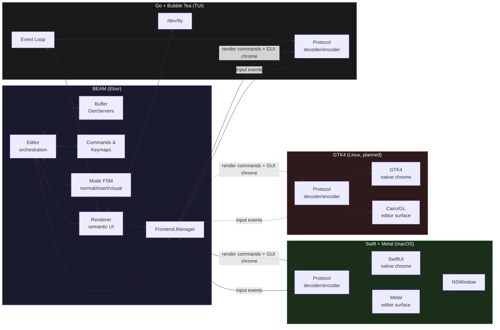
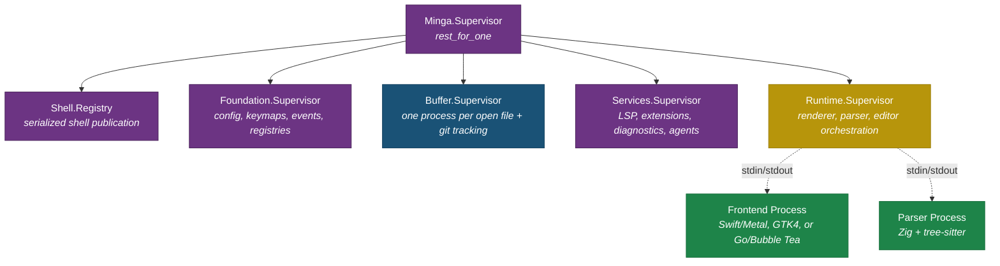
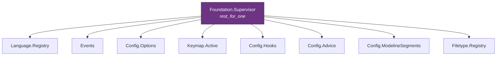
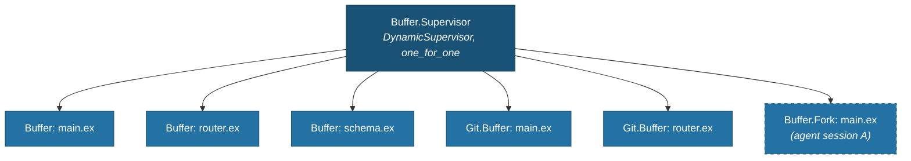
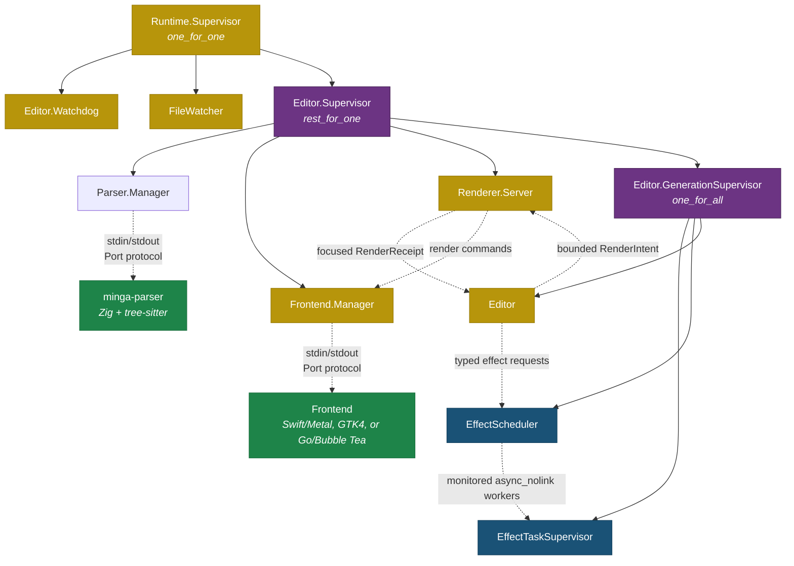
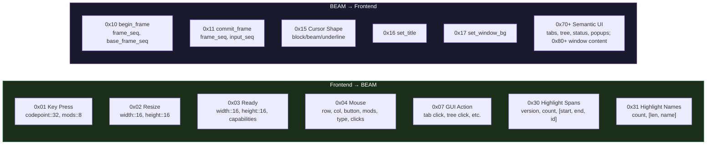
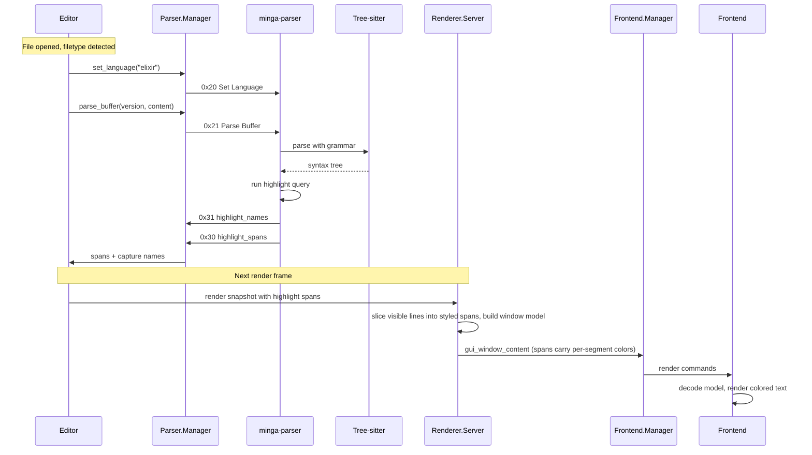
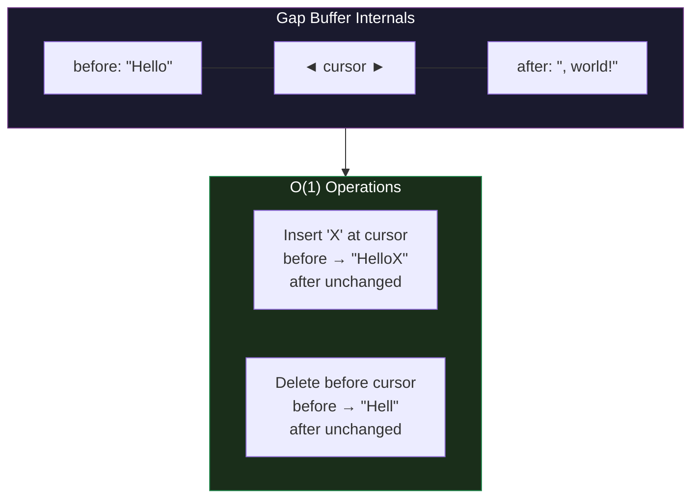

# Minga Architecture

How a text editor built on process isolation and preemptive concurrency actually works.

---

## The Big Idea

Most editors are single-threaded with shared state. Everything (buffers, rendering, input, plugins, AI agents) lives in one address space, contending for one event loop. When a background task does heavy work, your keystrokes queue up. When two things modify the same buffer, you get race conditions.

Minga splits the editor into **separate OS processes** with completely isolated memory: a BEAM process for all editor logic, and one or more frontend processes for rendering and input.


```mermaid
graph LR
    subgraph BEAM["BEAM (Elixir)"]
        ED2["Editor<br/>orchestration"]
        BUF["Buffer<br/>GenServers"]
        CMD["Commands &<br/>Keymaps"]
        MODE["Mode FSM<br/>normal/insert/visual"]
        RENDER["Renderer.Server"]
        PORT["Frontend.Manager"]

        ED2 <--> BUF
        ED2 <--> CMD
        ED2 <--> MODE
        ED2 --> RENDER
        RENDER --> PORT
        ED2 <--> PORT
    end

    subgraph SWIFT["Swift + Metal (macOS)"]
        SW_PROTO["Protocol<br/>decoder/encoder"]
        SW_CHROME["SwiftUI<br/>native chrome"]
        SW_RENDER["Metal<br/>editor surface"]
        SW_WIN["NSWindow"]

        SW_PROTO --> SW_CHROME
        SW_PROTO --> SW_RENDER
        SW_CHROME --> SW_WIN
        SW_RENDER --> SW_WIN
    end

    subgraph GTK["GTK4 (Linux, planned)"]
        GTK_PROTO["Protocol<br/>decoder/encoder"]
        GTK_CHROME["GTK4<br/>native chrome"]
        GTK_RENDER["Cairo/GL<br/>editor surface"]

        GTK_PROTO --> GTK_CHROME
        GTK_PROTO --> GTK_RENDER
    end

    subgraph GO["Go + Bubble Tea (TUI)"]
        EVLOOP["Event Loop"]
        GO_PROTO["Protocol<br/>decoder/encoder"]
        RENDER["Renderer<br/>semantic UI"]
        TTY["/dev/tty"]

        EVLOOP <--> GO_PROTO
        EVLOOP <--> RENDER
        RENDER <--> TTY
    end

    PORT -- "render commands + GUI chrome" --> SW_PROTO
    SW_PROTO -- "input events" --> PORT

    PORT -. "render commands + GUI chrome" .-> GTK_PROTO
    GTK_PROTO -. "input events" .-> PORT

    PORT -- "render commands + GUI chrome" --> GO_PROTO
    GO_PROTO -- "input events" --> PORT

    style BEAM fill:#1a1a2e,stroke:#6c3483,color:#fff
    style SWIFT fill:#1a2e1a,stroke:#1e8449,color:#fff
    style GTK fill:#2e1a1a,stroke:#844935,color:#fff
    style GO fill:#1a1a1a,stroke:#666666,color:#fff
```

All frontends communicate with the BEAM over the same binary protocol on stdin/stdout. They share no memory. The BEAM is the single source of truth for all editor state; frontends are "dumb" renderers and input sources. Every internal component (each buffer, the editor, the port manager, each future plugin) runs as its own lightweight BEAM process with its own state. They can't interfere with each other because the VM enforces the boundaries.

This isn't a workaround for a limitation. It's the whole point.

---

## Why the BEAM?

The Erlang VM (BEAM) was designed in the 1980s to run telephone switches: systems serving millions of concurrent connections that must stay responsive under load. Its design priorities map directly onto what a modern editor needs but has never had.

### Structural isolation through processes

Every buffer in Minga is its own BEAM process (a GenServer). Processes don't share memory. A buffer's state is only ever accessed by that buffer's process. Period.

```
Buffer.Supervisor (DynamicSupervisor, one_for_one)
├── Buffer "main.ex"     ← owns its own state
├── Buffer "router.ex"   ← completely independent memory
└── Buffer "schema.ex"   ← completely independent memory
```

This eliminates an entire class of bugs: data races, torn reads, iterator invalidation. When an AI agent edits line 200 of a file while you're typing on line 50, there's no race condition. Both edits arrive as messages to the buffer's GenServer, which processes them sequentially and atomically. The buffer's mailbox serializes all access naturally.

In a traditional editor, two things modifying the same buffer is a concurrency hazard. In Minga, it's just two messages in a queue.

### True preemptive concurrency

This is the strongest technical differentiator. The BEAM runs a preemptive scheduler with reduction counting that guarantees every process gets fair CPU time. Your keystroke handling is a process. LSP communication is a process. An AI agent is a process. The scheduler ensures none of them can starve the others.

This is qualitatively different from async/await or event loops. In Neovim, VS Code's extension host, or Emacs, "async" means cooperative multitasking: one thing runs at a time, and if it takes too long, everything else waits. The BEAM's scheduler preempts processes after a fixed number of reductions (roughly, function calls) regardless of whether they yield voluntarily.

The practical result: your typing is always responsive. Not because of careful async engineering, but because the VM enforces it at the scheduler level.

### Message passing over shared state

The Editor process never directly touches buffer memory. It sends messages:

```elixir
# Editor asks the buffer for its content
{content, cursor} = Buffer.Process.content_and_cursor(buffer_pid)

# Buffer process handles this in isolation
def handle_call(:content_and_cursor, _from, state) do
  {:reply, {Document.content(state.document), Document.cursor(state.document)}, state}
end
```

No locks. No mutexes. No "file changed on disk" dialogs. Just processes with private state communicating through well-defined messages.

### One Editor mailbox, focused value owners

`MingaEditor` is one GenServer and remains the single authority that serializes interactive editor state. Decomposing its state does not create a process per feature. Input ordering, shell changes, workspace transitions, renderer receipts, and lifecycle messages still pass through one mailbox, while immutable sub-structs give each behavior a narrow transition API.

The root `MingaEditor.State` contains 16 cohesive values:

| Root value | Owner | Responsibility |
|---|---|---|
| `workspace` | `MingaEditor.Session.State` | Active tab editing context: buffers, windows, mode state, search, file tree, mouse, hover, and agent UI. |
| `shell_runtime` | `MingaEditor.Shell.Runtime` | Active shell identity, implementation state, and exact-identity stash. |
| `frontend` | `MingaEditor.State.Frontend` | Transport, backend, capabilities, terminal viewport, pressure, and input correlation. |
| `render` | `MingaEditor.State.Render` | Renderer connection, render correlation, messages, layout, focus, and cursor observations. |
| `parser` | `MingaEditor.State.Parser` | Parser manager and status, highlighting, injections, and face registries. |
| `agent_connection` | `MingaEditor.State.AgentConnection` | Agent provider configuration and ingest connection. |
| `interaction` | `MingaEditor.State.Interaction` | Editing model, keymap and option servers, focus stack, and keystroke history. |
| `extension_surfaces` | `MingaEditor.State.ExtensionSurfaces` | Event, sidebar, and semantic-agent registries. |
| `buffer_lifecycle` | `MingaEditor.State.BufferLifecycle` | Buffer monitors and add context. |
| `git` | `MingaEditor.State.Git` | Remote and commit-generation correlation plus diff views. |
| `session` | `MingaEditor.State.Session` | Persistence, save timer, startup, pending quit, and test-command lifecycle. |
| `effect_scheduler` | `MingaEditor.EffectScheduler` | Process handle for bounded asynchronous resource work. |
| `feedback` | `MingaEditor.State.Feedback` | Notifications and operation feedback. |
| `lsp` | `MingaEditor.State.LSP` | LSP status, presentation, debounce, and operation correlation. |
| `remote` | `MingaEditor.State.Remote` | Remote sessions, status, and buffers. |
| `appearance` | `MingaEditor.State.Appearance` | Theme, font override, and cached native settings. |

A leaf transition goes directly to its owner. The calling workflow may install the owner-produced result into the matching top-level root field, but it may not compute the transition itself or pass through a root wrapper. `MingaEditor.State` keeps only pure atomic transitions that span at least two root owners, such as theme plus parser synchronization, renderer receipt acceptance and projection, frontend observation reset, buffer lifecycle changes, tab snapshot and restore, and extension feature cleanup. Root query facades and broad tab or workspace function mappers do not exist; callers query the workspace, shell runtime, Git value, tab context, or tab bar that owns the data and use named identity-preserving transitions. `Minga.Credo.EditorStateOwnershipCheck` verifies these ownership and purity boundaries with an empty exception allowlist.

External work stays in the focused workflow that requested it. `MingaEditor.TabWorkflow` owns shell resolution, remote replay, session and transcript synchronization, timers, and modal presentation around the pure root tab transition. `MingaEditor.Handlers.BufferRegistry` creates buffer monitors and performs parser and logging cleanup around pure registration and removal transitions. `MingaEditor.FeatureStateWorkflow` resolves shell registrations before atomic cleanup, `MingaEditor.BufferFileIdentity` derives project-aware file references before identity-preserving tab and workspace rebinding, and `MingaEditor.Renderer.ReceiptProjection` purely projects an accepted receipt through its three value owners. Slow resource work uses typed `MingaEditor.Effect.Request` and `MingaEditor.Effect.Outcome` values through `MingaEditor.EffectScheduler`; the scheduler owns admission and worker lifecycle, while each originating workflow owns domain staleness, state application, feedback, and rendering. There is no universal effect dispatcher. See [ADR-0002](adr/0002-editor-state-transitions-have-explicit-owners.md) for the full ownership ledger and contributor rules.

### Per-process garbage collection

Each BEAM process has its own heap and its own garbage collector. When a buffer process GCs, it doesn't pause the editor or the renderer. A large file's buffer can collect its garbage without affecting the responsiveness of a small file you're actively editing.

Traditional editors in GC'd languages (VS Code/Electron, editors in Java or Go) have global GC pauses that cause visible input latency spikes. The BEAM's per-process GC eliminates this entirely.

### Supervision: graceful degradation

BEAM processes are organized into supervision trees that encode dependency relationships. When a component fails, its supervisor can restart it without affecting unrelated components.

### High-level overview

The top-level supervisor splits the system into four tiers and starts `MingaEditor.Shell.Registry` as the serialized publisher that all shell selection paths depend on. Each tier is isolated so that a crash in one doesn't cascade into the others. `rest_for_one` means tiers restart in order: if the shell registry or Foundation restarts, everything below it restarts too. A Runtime crash does not touch Services, Buffers, Foundation, or the shell registry.


```mermaid
graph TD
    SUP["Minga.Supervisor<br/><i>rest_for_one</i>"]

    SUP --> SHELLS["Shell.Registry<br/><i>serialized shell publication</i>"]
    SUP --> FOUND["Foundation.Supervisor<br/><i>config, keymaps, events, registries</i>"]
    SUP --> BUFSUP["Buffer.Supervisor<br/><i>one process per open file + git tracking</i>"]
    SUP --> SVC["Services.Supervisor<br/><i>LSP, extensions, diagnostics, agents</i>"]
    SUP --> RT["Runtime.Supervisor<br/><i>renderer, parser, editor orchestration</i>"]

    RT -. "stdin/stdout" .-> FE["Frontend Process<br/><i>Swift/Metal, GTK4, or Go/Bubble Tea</i>"]
    RT -. "stdin/stdout" .-> PARSER["Parser Process<br/><i>Zig + tree-sitter</i>"]

    style SUP fill:#6c3483,stroke:#4a235a,color:#fff
    style SHELLS fill:#6c3483,stroke:#4a235a,color:#fff
    style FOUND fill:#6c3483,stroke:#4a235a,color:#fff
    style BUFSUP fill:#1a5276,stroke:#154360,color:#fff
    style SVC fill:#6c3483,stroke:#4a235a,color:#fff
    style RT fill:#b7950b,stroke:#9a7d0a,color:#fff
    style FE fill:#1e8449,stroke:#196f3d,color:#fff
    style PARSER fill:#1e8449,stroke:#196f3d,color:#fff
```

### Foundation tier

Stateless registries and configuration that everything else depends on. These rarely fail. `Config.ModelineSegments` owns the ETS table for user and extension-provided modeline segment renderers, so config reloads can replace those renderers without coupling extensions to the editor renderer.


```mermaid
graph TD
    FOUND["Foundation.Supervisor<br/><i>rest_for_one</i>"]
    FOUND --> LANG["Language.Registry"]
    FOUND --> EVENTS["Events"]
    FOUND --> OPTS["Config.Options"]
    FOUND --> KEYMAP["Keymap.Active"]
    FOUND --> HOOKS["Config.Hooks"]
    FOUND --> ADVICE["Config.Advice"]
    FOUND --> MODELINE["Config.ModelineSegments"]
    FOUND --> FT["Filetype.Registry"]

    style FOUND fill:#6c3483,stroke:#4a235a,color:#fff
```

### Buffer tier

One process per open file, plus per-buffer git tracking. `one_for_one` means each buffer is independent: one buffer crashing doesn't affect any other.


```mermaid
graph TD
    BUFSUP["Buffer.Supervisor<br/><i>DynamicSupervisor, one_for_one</i>"]
    BUFSUP --> B1["Buffer: main.ex"]
    BUFSUP --> B2["Buffer: router.ex"]
    BUFSUP --> B3["Buffer: schema.ex"]
    BUFSUP --> GB1["Git.Buffer: main.ex"]
    BUFSUP --> GB2["Git.Buffer: router.ex"]
    BUFSUP --> BF1["Buffer.Fork: main.ex<br/><i>(agent session A)</i>"]

    style BUFSUP fill:#1a5276,stroke:#154360,color:#fff
    style B1 fill:#2471a3,stroke:#1a5276,color:#fff
    style B2 fill:#2471a3,stroke:#1a5276,color:#fff
    style B3 fill:#2471a3,stroke:#1a5276,color:#fff
    style GB1 fill:#2471a3,stroke:#1a5276,color:#fff
    style GB2 fill:#2471a3,stroke:#1a5276,color:#fff
    style BF1 fill:#2471a3,stroke:#1a5276,color:#fff,stroke-dasharray: 5 5
```

> **Note:** `Buffer.Fork` processes (dashed border) are created on demand when an agent session edits a file that has an open buffer. The fork holds an independent copy; the user keeps editing the parent. On session completion, changes merge back via three-way merge. See [Buffer-Aware Agents](BUFFER-AWARE-AGENTS.md) for the full design.

### Services tier

Higher-level features that depend on Foundation and Buffers but are independent of the renderer. A git tracking crash restarts only Git.Tracker. An LSP server crash restarts only that client.


```mermaid
graph TD
    SVC["Services.Supervisor<br/><i>rest_for_one</i>"]
    SVC --> INDEP["Services.Independent<br/><i>one_for_one</i>"]
    INDEP --> GIT["Git.Tracker"]
    INDEP --> TASKSUP["Eval.TaskSupervisor"]
    INDEP --> CMDREG["Command.Registry"]
    INDEP --> DIAG["Diagnostics"]
    SVC --> EXTREG["Extension.Registry<br/><i>declaration/status projection</i>"]
    SVC --> ARTGEN["Extension.ArtifactGenerationState<br/><i>persistent provenance</i>"]
    SVC --> ARTADM["Extension.ArtifactAdmission<br/><i>generation serializer</i>"]
    SVC --> LEASE["Extension.CodeLease<br/><i>callback work drain</i>"]
    SVC --> CALLBACKS["Extension.CallbackRegistry<br/><i>declarative callbacks</i>"]
    SVC --> INSTREG["Extension.InstanceRegistry<br/><i>stable process names</i>"]
    SVC --> ROOTSUP["Extension.RootSupervisor<br/><i>DynamicSupervisor</i>"]
    ROOTSUP --> ROOT1["Extension.Root: git_porcelain<br/><i>rest_for_one</i>"]
    ROOT1 --> RTSUP1["RuntimeSupervisor<br/><i>temporary runtime children</i>"]
    ROOT1 --> INST1["Instance<br/><i>lifecycle authority</i>"]
    RTSUP1 --> EXT1["Extension runtime child"]
    ROOTSUP --> ROOT2["Extension.Root: user_extension<br/><i>rest_for_one</i>"]
    ROOT2 --> RTSUP2["RuntimeSupervisor"]
    ROOT2 --> INST2["Instance"]
    SVC --> AGENTREG["Agent contribution registries"]
    SVC --> LOADER["Config.Loader"]
    SVC --> LSPSUP["LSP.Supervisor<br/><i>DynamicSupervisor</i>"]
    LSPSUP --> LSP1["LSP Client: elixir-ls"]
    LSPSUP --> LSP2["LSP Client: lua-ls"]
    SVC --> SYNC["LSP.SyncServer"]
    SVC --> PROJ["Project"]
    PROJ -. "one per active inventory" .-> DISC["Project.FileFind.Worker<br/><i>monitored, cancellable</i>"]

    style SVC fill:#6c3483,stroke:#4a235a,color:#fff
    style INDEP fill:#6c3483,stroke:#4a235a,color:#fff
    style ROOTSUP fill:#1a5276,stroke:#154360,color:#fff
    style ROOT1 fill:#6c3483,stroke:#4a235a,color:#fff
    style ROOT2 fill:#6c3483,stroke:#4a235a,color:#fff
    style INST1 fill:#884ea0,stroke:#6c3483,color:#fff
    style INST2 fill:#884ea0,stroke:#6c3483,color:#fff
    style RTSUP1 fill:#1a5276,stroke:#154360,color:#fff
    style RTSUP2 fill:#1a5276,stroke:#154360,color:#fff
    style EXT1 fill:#2471a3,stroke:#1a5276,color:#fff
    style LSPSUP fill:#1a5276,stroke:#154360,color:#fff
    style TASKSUP fill:#1a5276,stroke:#154360,color:#fff
    style DISC fill:#1a5276,stroke:#154360,color:#fff
    style LSP1 fill:#2471a3,stroke:#1a5276,color:#fff
    style LSP2 fill:#2471a3,stroke:#1a5276,color:#fff
```

Each extension declaration gets one ordered root beneath `Minga.Extension.RootSupervisor`. The root starts its local `RuntimeSupervisor` before its permanent `Instance`, using `rest_for_one` so replacing the runtime supervisor also replaces the Instance only after an empty local runtime supervisor exists. An Instance crash leaves its own runtime supervisor in place, allowing the replacement Instance to adopt only that extension's local runtime. Runtime children never serve as lifecycle identities.

`Minga.Project` only starts recursive file inventory for an explicit directory workspace root. Root paths are canonicalized before authorization so symlink aliases cannot bypass broad-root protection. Each inventory runs in a monitored `Minga.Project.FileFind.Worker` that owns the external `git`, `fd`, or `find` process, bounds command output, and enforces a timeout for synchronous callers. Switching or closing the workspace, timing out, or stopping the Project service waits for the worker to terminate the external process tree.

### Runtime tier

The runtime tier handles rendering and user interaction. `rest_for_one` keeps the render path ordered: if Frontend.Manager fails, Renderer.Server and the Editor generation restart because both depend on the frontend port. If Renderer.Server fails, the Editor generation restarts because Editor holds the renderer pid. The generation is a `one_for_all` boundary around Editor, its effect scheduler, and supervised effect workers. An Editor crash therefore stops every old formatting or git mutation worker before replacement authority starts. Buffers remain outside this boundary, so undo history, cursor positions, and unsaved changes are preserved.


```mermaid
graph TD
    RT["Runtime.Supervisor<br/><i>one_for_one</i>"]
    RT --> WD["Editor.Watchdog"]
    RT --> FW["FileWatcher"]
    RT --> EDSUP["Editor.Supervisor<br/><i>rest_for_one</i>"]
    EDSUP --> PARSER["Parser.Manager"]
    EDSUP --> PM["Frontend.Manager"]
    EDSUP --> RENDER["Renderer.Server"]
    EDSUP --> GEN["Editor.GenerationSupervisor<br/><i>one_for_all</i>"]
    GEN --> TASKS["EffectTaskSupervisor"]
    GEN --> EFFECTS["EffectScheduler"]
    GEN --> ED["Editor"]

    ED -. "typed effect requests" .-> EFFECTS
    EFFECTS -. "monitored async_nolink workers" .-> TASKS
    ED -. "bounded RenderIntent" .-> RENDER
    RENDER -. "focused RenderReceipt" .-> ED
    RENDER -. "render commands" .-> PM
    PM -. "stdin/stdout<br/>Port protocol" .-> FE["Frontend<br/><i>Swift/Metal, GTK4, or Go/Bubble Tea</i>"]
    PARSER -. "stdin/stdout<br/>Port protocol" .-> ZIG_P["minga-parser<br/><i>Zig + tree-sitter</i>"]

    style RT fill:#b7950b,stroke:#9a7d0a,color:#fff
    style EDSUP fill:#6c3483,stroke:#4a235a,color:#fff
    style PM fill:#b7950b,stroke:#9a7d0a,color:#fff
    style RENDER fill:#b7950b,stroke:#9a7d0a,color:#fff
    style GEN fill:#6c3483,stroke:#4a235a,color:#fff
    style TASKS fill:#1a5276,stroke:#154360,color:#fff
    style EFFECTS fill:#1a5276,stroke:#154360,color:#fff
    style ED fill:#b7950b,stroke:#9a7d0a,color:#fff
    style WD fill:#b7950b,stroke:#9a7d0a,color:#fff
    style FW fill:#b7950b,stroke:#9a7d0a,color:#fff
    style FE fill:#1e8449,stroke:#196f3d,color:#fff
    style ZIG_P fill:#1e8449,stroke:#196f3d,color:#fff
```

### Why this structure matters

The nested supervisors constrain blast radius. Losing your LSP connection doesn't affect editing. A plugin error doesn't corrupt your buffers. A filesystem watcher flake restarts only FileWatcher, not the renderer. The `rest_for_one` chains within Foundation and Services preserve real dependency ordering, including Events before Config subscribers and extension admission, callback, registry, and root authorities before Config.Loader, while preventing unrelated siblings from cascading into each other.

The system degrades in pieces rather than failing all at once. The BEAM was designed for telecom systems that run for years without downtime. The same supervision engineering applies here.

---

## Why Native Frontends?

The BEAM is excellent at concurrency and isolation. It is terrible at putting pixels on screen. It has no concept of terminal modes, GPU rendering, or native window systems. Minga solves this by running frontends as separate OS processes that communicate with the BEAM over a binary protocol.

### Platform-native rendering and Semantic UI

Minga's frontends use the best native toolkit for their rendering surface, but they consume one BEAM-owned Semantic UI contract for shared visible UI:

- **macOS: Swift + Metal.** SwiftUI renders chrome (tab bar, file tree, status bar, popups) as native views. Metal renders the editor text surface with GPU-accelerated glyph rasterization via CoreText. This gives macOS users native scrolling, system fonts, trackpad gestures, and full accessibility support.
- **Linux: GTK4 (planned).** GTK4 widgets for chrome, Cairo or OpenGL for the text surface. Native Wayland/X11 integration, IME support, system theming.
- **Terminal: Go + Bubble Tea.** The terminal frontend is a semantic Charm/Bubble Tea client that renders the same Semantic UI models as native GUI clients, and it is the only terminal frontend. The launch path is BEAM-owned: Minga starts the editor core, spawns the Go renderer as a Port, and passes `MINGA_TTY` so Go can drive the real terminal while stdin/stdout remain the packet protocol. The legacy Zig/libvaxis cell-grid renderer was removed in #2223; Zig is now parser infrastructure only.
- **Parser: Zig + tree-sitter.** Zig remains parser infrastructure (the `minga-parser` Port); it embeds the tree-sitter C grammars directly and stays in place regardless of the terminal frontend choice.

Each frontend is a "dumb" renderer and input source: it reads Semantic UI and protocol commands, draws them using its own surface primitives, and writes input events back to stdout. All editor state and product policy live in the BEAM.

### Why keep Zig for the parser?

Zig currently owns the tree-sitter parser process. It remains a good fit for that code while the parser is still implemented there because:

- **Compiles C natively:** tree-sitter grammars (written in C) compile as part of the Zig build with zero FFI overhead
- **No hidden allocations:** important for the parser's memory-sensitive hot loop
- **Single binary output:** no dynamic linking, no runtime dependencies

### Why not a NIF?

NIFs (Native Implemented Functions) run inside the BEAM process. A failure in a NIF takes down the entire Erlang VM: every buffer, every process, everything. This directly contradicts Minga's isolation model.

A Port is an OS-level process boundary. A frontend can crash completely, and the BEAM keeps running. The supervisor detects the Port died, restarts the Frontend.Manager, Renderer.Server, and Editor, then the Editor re-renders from buffer state. Your data stays intact because it lives in completely separate processes.

---

## The Port Protocol

BEAM and the frontend communicate via `{:packet, 4}`: each message is prefixed with a 4-byte big-endian length, followed by a 1-byte opcode and opcode-specific binary fields. This is a simple, fast, zero-copy-friendly wire format.

The cell-paradigm render opcodes (`draw_text`, `set_cursor`, `clear`, the region commands) were retired in protocol_version 2, and `batch_end` was replaced by the begin/commit frame transaction in protocol_version 3 (#2219). All visible content now flows through Semantic UI opcodes (the `0x70`+ family; window/buffer content rides `gui_window_content` at `0x80` and up), bracketed by a frame transaction. Only transport-level framing (frame boundaries, cursor shape, title, window background, font, protocol_error) survives in the render-transport category.

The protocol has 20+ opcodes covering rendering, input, syntax highlighting, and diagnostics:


```mermaid
graph LR
    subgraph FrontendToBEAM["Frontend → BEAM"]
        K["0x01 Key Press<br/>codepoint::32, mods::8"]
        R["0x02 Resize<br/>width::16, height::16"]
        RDY["0x03 Ready<br/>width::16, height::16, capabilities"]
        M["0x04 Mouse<br/>row, col, button, mods, type, clicks"]
        GA["0x07 GUI Action<br/>tab click, tree click, etc."]
        HS["0x30 Highlight Spans<br/>version, count, [start, end, id]"]
        HN["0x31 Highlight Names<br/>count, [len, name]"]
    end

    subgraph BEAMToFrontend["BEAM → Frontend"]
        BF["0x10 begin_frame<br/>frame_seq, base_frame_seq"]
        CF["0x11 commit_frame<br/>frame_seq, input_seq"]
        CS["0x15 Cursor Shape<br/>block/beam/underline"]
        TI["0x16 set_title"]
        WB["0x17 set_window_bg"]
        GUI["0x70+ Semantic UI<br/>tabs, tree, status, popups; 0x80+ window content"]
    end

    style FrontendToBEAM fill:#1a2e1a,stroke:#1e8449,color:#fff
    style BEAMToFrontend fill:#1a1a2e,stroke:#6c3483,color:#fff
```

For the full specification with byte-level field descriptions, sequencing rules, and implementation guidance, see **[docs/PROTOCOL.md](PROTOCOL.md)**. For the Semantic UI opcodes historically named GUI chrome, see **[docs/GUI_PROTOCOL.md](GUI_PROTOCOL.md)**.

Any process that implements the frontend behavior and speaks this protocol can serve as a Minga rendering backend. Frontend identity is opaque to product behavior; capabilities describe the surface and feature support. The macOS Swift frontend is the polish reference, the Go terminal frontend is the only terminal frontend, and GTK4 remains planned for Linux. The legacy Zig/libvaxis cell-grid renderer was removed in #2223.

### The Render Model and the rendering pipeline

The BEAM does not paint cells. It builds a **semantic render model** (`Minga.RenderModel`) and hands it to per-frontend adapter encoders, which serialize it to the wire. Every live frontend (macOS GUI and Go TUI) decodes that model and draws it with its own native primitives. There is no shared cell grid, no styled-text-run IR sitting between editor state and the protocol, and no last-mile text-run translation on any frontend. The TUI decodes the same semantic models as the GUI; it is a semantic client, not a terminal-cell renderer (the legacy cell-grid TUI was removed in #2223).

The render path runs as an explicit pipeline whose stages narrow editor intent down to the literal product the adapters encode. The Editor and Renderer are separate BEAM processes with an explicit ownership boundary: the Editor sends a bounded `MingaEditor.RenderPipeline.Intent` containing window/buffer identities, observed versions, viewport/cursor/chrome state, and immutable semantic inputs. It never sends resident row stores, full document line lists, adapter caches, font registration, or acknowledgement state. `MingaEditor.Renderer.State` is the single writer for those values, with one `ResidentWindowState` per stable window/buffer pair. The Renderer returns only a `RenderReceipt` containing layout/focus/click-region and shell transitions plus frame correlation metadata; stale receipt sequences and replaced shell identities are side-effect free.

For changed buffers, the Renderer groups all windows by buffer PID, consumes `Buffer.consume_edit_deltas(buffer, :renderer)` once per observed version, and fans the ordered deltas to every matching resident window. Durable logical-line identity and resident composition splice from those deltas. Initial hydration, `:reset_required`, buffer replacement/restart, irreconcilable identity, or a global composition-context change performs one explicit full hydration in a fresh content epoch, then resumes delta consumption. Window close, buffer switch, reset, and exact monitored-buffer `:DOWN` all use the centralized `Renderer.State` cleanup path.

```
RenderIntent + Renderer.State
   │  Content stage (RenderPipeline.Content)
   ▼  builds Minga.RenderModel.Window models per editor window
WindowContent carriers (RenderPipeline.WindowContent)
   │  Compose stage flattens them across all windows
   ▼
ComposedFrame (RenderPipeline.ComposedFrame)   ← the literal pipeline product (#2241)
   │  holds the flattened RenderModel.Window list + the single resolved RenderModel.Cursor
   ▼  RenderModel.Builder reads those two fields directly; Chrome/UI surfaces ride alongside
Minga.RenderModel
   │  Emit stage (Frontend.Emit)
   ▼
adapter encoders (Minga.Frontend.Adapter.GUI)  →  semantic protocol commands on the wire
```

Chrome and shared UI (tab bars, file trees, status bars, which-key popups, completion menus, agent chat, popups) are not cells either. They are `Minga.RenderModel.UI.*` values built into the same render model and encoded as Semantic UI opcodes (the `0x70`+ family — tab bar `0x71`, status bar `0x76`, and so on — distinct from the `gui_window_content` buffer-rendering opcodes at `0x80` and up; see [docs/GUI_PROTOCOL.md](GUI_PROTOCOL.md)). Each frontend renders them as platform-native widgets or terminal widgets. The status bar resolves the same configured modeline segments for every semantic frontend, then ships styled segment data in the `gui_status_bar` payload so custom and hidden segments stay in sync across frontends.

Because the model carries character offsets, not pixel positions, the same model drives both monospaced and variable-width font rendering in GUI frontends: a monospaced frontend multiplies by cell width; a proportional frontend measures preceding characters to find the pixel X. The `measure_text` opcode handles the cases where the BEAM needs the frontend to measure precise display widths.

#### What survives of the DisplayList

`MingaEditor.DisplayList` still exists, but it is no longer "what's on screen". The cell-grid window carriers (`Frame`, `WindowFrame`) were removed in #2241, and the per-surface chrome painters (completion menu, hover/signature popups, modeline, tab bar, float popups) were deleted in #2311, because the semantic frontends render those surfaces natively. What remains is a small set of `draw/4` + `Overlay` primitives for renderers that still produce raw draw tuples or popup geometry: extension block decorations (`Core.Decorations.BlockDecoration`), the popup-geometry `:content` draw list used to size floating windows, the `Overlay` carrier whose `cursor` field still resolves the picker cursor in Compose, and the Git Porcelain extension shell renderer. It is a leftover for extension and popup geometry paths, not the pipeline's spine.

---

## Frame Transactions

A frame is atomic on the wire. The Emit stage brackets every frame's semantic and chrome commands between `begin_frame{frame_seq, base_frame_seq}` and `commit_frame{frame_seq, input_seq}` (`MingaEditor.Frontend.Emit`, epic #2219). The frontend decodes the commands into a staging model and atomically swaps it in only on `commit_frame`, so `View()` never paints a half-applied frame. `frame_seq` is the strictly monotonic global frame sequence; `input_seq` echoes the latest input correlation sequence so the frontend can resolve a keystroke-to-write latency sample.

**Keyframe-as-attach.** There is no separate keyframe opcode. A keyframe is just a transaction whose `base_frame_seq == 0`: it depends on no prior frame, so it carries full snapshots (every window as full `gui_window_content`, every chrome surface re-emitted, title and window background re-sent) instead of deltas against a base the client may never have seen. A keyframe is forced when the frontend sends `request_keyframe`, and it is also the first-frame state by construction (`last_emitted_frame_seq == 0`). Because a fresh client re-readies and any `ready` zeroes the emit cache, the first frame after any reconnect is full for free. This doubles as the attach handshake: a frontend that connects mid-session decodes one self-contained keyframe and is immediately consistent. See [Attach protocol](#attach-protocol-how-a-frontend-joins-a-running-session) for the daemon-scope details and the honest single-port limitation.

**Debounced resync.** Four conditions invalidate the in-flight frame on the frontend: truncation (a new `begin_frame` before the open transaction commits), seq mismatch, an unsizable/unknown opcode inside a transaction, and a base mismatch (a delta whose `base_frame_seq` names a frame the client never committed). On any of these the frontend discards its staged frame and sends `request_keyframe(last_good_frame_seq)`. The request is **debounced**: after an invalidation, every stale in-flight frame also fails its base check, so the Go model latches a `resyncPending` flag and sends exactly one keyframe request per resync window (`go/tui/internal/ui/model.go`), clearing it when a clean commit applies. The BEAM responds by setting `keyframe_pending?` and forcing the next frame to a keyframe (`MingaEditor.handle_info({:request_keyframe, _})`).

**The out-of-band allowlist.** A small set of commands is sanctioned to ride outside the transaction bracket. `set_title` and `set_window_bg` are side-channel writes the Emit stage sends only when they change (`send_title`/`send_window_bg`); if one happens to arrive inside an open transaction it still stages so the swap stays atomic, otherwise it applies directly. `protocol_error` is out-of-band by design: the BEAM rejected the frontend's handshake `protocol_version`, so it never enters a transaction; the frontend latches the reason and renders a blocking error surface. Everything else (semantic and chrome commands) is a protocol violation outside a transaction and triggers a resync rather than a partial paint.

**The ephemeral-layer carve-out.** The transaction model says the BEAM owns structure, not pixels. A documented client-local ephemeral layer states what a frontend may render *between* commits without a round-trip: cursor blink, spinners, smooth scroll, local scrollback. The line is hit-testing: anything the BEAM hit-tests against (any placed surface) must come through a frame transaction, because input correctness depends on the BEAM and the frontend agreeing on geometry. Purely visual, non-interactive motion may live in the frontend. This is an accepted, bounded impurity, not a general escape hatch.

**Frontend-local interaction state.** Semantic frontends are not dumb terminals. The BEAM owns the authoritative semantic model, durable editor state, placement, stacking, containment, and validation of committed actions. Frontends own zero-latency local interaction state when it can be resolved from the last committed semantic model and has no durable effect until activation. This is not about event frequency. It is about whether the interaction should feel instant without waiting for a BEAM render transaction.

Each frontend holds a single local-presentation container with one discard entry point, parameterized by transform kind. Two transform kinds exist:

- **Offset transforms** (smooth scroll): the frontend applies a local pixel or row/column offset on top of the BEAM's committed anchor. Discard on `reset_required` or anchor-key mismatch (the key is `{contentEpoch, layoutGeneration, anchorTop, anchorLeft}`; see `ScrollPresentation` in the protocol). The offset has no row identity; it shifts the viewport within the committed overscan bounds.
- **Identity transforms** (file-tree selection, completion selection): the frontend previews a new selected index over the BEAM's committed row model. Discard on BEAM update (the next authoritative payload reconciles the prediction) or `retained_row_miss` (the previewed row's stable ID is absent from the committed model).

The shared code is the container and dispatch; the row-identity check is a capability of identity transforms, not a universal step. Applying `retained_row_miss` to scroll would be wrong because scroll has no row identity.

Cursor motion and selection extension are **out of bounds** for local presentation. They are operands the BEAM hit-tests and encodes, never client-decided. The BEAM resolves cursor position against the buffer, wrap state, fold state, and virtual text; the frontend cannot predict the result without duplicating that logic.

File tree is the canonical example. The BEAM sends stable row IDs, paths, labels, icons, expansion state, git state, diagnostics, focus context, and inline editing state. The frontend may own transient row selection while the user navigates the already committed row model. On activation, toggle, rename, delete, drag/drop, or another committed intent, the frontend sends a semantic action with stable row identity. The BEAM validates the action against its current model and may resync if the row is stale.

---

## Surface Placement Authority

The BEAM is the single authority for where every surface sits and which one wins when surfaces overlap. `MingaEditor.Layout.SurfaceRegistry` is a pure calculation (state in, placements out) that flattens the focus tree into an ordered list of placements, each carrying a `surface_id`, a `rect` (terminal cells), a `z` band, and a `hit_kind`. The list is ordered back-to-front by `z`, so a stable sort reproduces paint order and a reverse walk reproduces hit-test precedence. Because the registry projects the same focus tree that already drives mouse routing, the rect it emits for a surface *is* the rect every hit-test uses, by construction.

These placements are emitted inside the frame transaction as a `gui_surface_layout` command (`Minga.Frontend.Adapter.GUI.SurfaceLayoutEncoder`, from `ctx.surface_placements`). One rect+z list does double duty: the frontend composites surfaces by `z` and derives its mouse zones from these rects, and the BEAM arbitrates stacking and containment from the same placements. The Go compositor's old hand-ordered `overlayLines()` fallback table is gone; every overlay surface is now a focus-tree node with a BEAM-authoritative rect (#2268 → #2281). Footer-band secondary overlays (float popup, agent context, extension panel, observatory, edit timeline, notifications, extension overlay) are content-height-sized and bottom-anchored via `MingaEditor.Layout.OverlayBand`, carrying their historical stacking z so the single highest-z winner positions at its placement rect instead of footer-appending.

The registry owns surface *rects and z-order*, not every handler's interpretation of a click inside its surface. Intra-window geometry (gutter width, fold column, cell-to-buffer-line) stays in `MingaEditor.Mouse.HitTest`; the agent window's chat/preview/prompt sub-division stays in `Input.AgentMouse`; per-segment tab-bar and modeline click regions stay as render-time text-property spans. The registry places the surface; the handler interprets the click.

### The input rule

This is the design of record (recorded on epic #2330) for all surface input:

> **Clients resolve clicks on content they render and send semantic intents (`gui_actions`); the BEAM owns placement, stacking, and containment for registry-placed surfaces.**

A frontend hit-tests its own rendered content and emits an intent ("completion item 3 selected", "notification N dismissed"), exactly the contract SwiftUI already uses (native hit-test to `gui_action`). One pipeline, one way of doing things, on every client. The BEAM does not re-derive what a click means on rendered content. It owns structure: which rect a surface occupies, which surface wins when rects overlap (stacking depends on editor state only the BEAM has), and containment, so a click that misses every interactive element of a placed surface is swallowed (`MingaEditor.Input.OverlaySink`) instead of falling through to the buffer underneath.

Worked examples. Completion menu, notifications (dismiss and action), observatory rows, edit-timeline entries, and the float popup are all client-resolved on both frontends: the Go TUI tracks click zones (`completion:item:`, `notification:action:`, `observatory:node:`, `timeline:entry:`) and emits the matching `gui_action`, mirroring SwiftUI's native hit-testing. **The picker is the one documented exception:** it predates this rule and stays BEAM-resolved as shipped, to be aligned only if it ever needs rework.

---

## Two-Tier Rendering

Rendering avoids redundant work on both sides of the protocol, with telemetry so the savings are observable rather than assumed.

**BEAM: renderer-owned retained rows and delta composition (#2287, #2742).** `MingaEditor.RenderPipeline.Classifier` tags each frame `:patch` or `:full`. Both paths run the same seven stages and emit the same transaction with the same encodings; the tag is observability, not a fork. Renderer-owned resident and row-retention state lets unchanged rows skip composition. Ordinary edits derive dirty/source ranges from ordered buffer `EditDelta` values and preserve durable row identity while the #2741 `RowDelta` encoder emits structural splices. Anything requiring global composition context (resize, theme/font change, full re-highlight, reset, or unreconcilable identity) performs an explicit hydration/full replacement, after which the same resident state returns to deltas. Classification remains observability only, so a pessimistic label cannot change correctness.

**Go: composed-line cache (#2288).** The Go TUI memoizes each window body row's rendered string (`go/tui/internal/ui/line_cache.go`) so a window-content delta whose rows are mostly refs reuses the previously composed lines instead of re-running the lipgloss tree per row per frame. Correctness over cleverness: a cached line is returned only when every input that produced it (content hash, per-window context, and row index) is identical, so patched output is byte-identical to a from-scratch compose. Per-frame hit/miss counters feed the latency HUD and tests.

**Agent stream: coalescing ingest (#2289).** Agent token deltas can arrive at hundreds of messages per second. Delivered straight into the Editor mailbox, each runs a real buffer write and sits FIFO ahead of any queued keystroke (head-of-line blocking that jitters latency under streaming load). `MingaEditor.Agent.Ingest` sits between the session and the Editor, subscribing on the Editor's behalf so deltas land in *its* mailbox. It forwards one `{:agent_stream_batch, ...}` per coalescing window using a leading + trailing edge strategy: the first delta after idle forwards immediately (time-to-first-token unchanged), then deltas within the window accumulate and flush as a single batch on a tick. Control events (status change, tool start/end, turn end) flush the pending batch ahead of themselves in order, so the Editor never sees a turn end before its trailing text.

---

## Life of a Keystroke

Here's what happens when you press `dd` (delete a line) in normal mode. The measured end-to-end keystroke latency is ~1ms locally (see [Latency](#latency-measured-not-asserted) for the committed baseline and the CI gate); the BEAM side of that round-trip is a small fraction of it.

```mermaid
sequenceDiagram
    participant FE as Frontend<br/>(Swift or Go TUI)
    participant PM as Frontend.Manager
    participant Ed as Editor
    participant Render as Renderer.Server
    participant Mode as Mode.Normal
    participant Buf as Buffer.Process

    FE->>FE: decode platform input event
    FE->>PM: key_press(0x01) via stdout

    Note over Ed,Mode: First 'd'
    PM->>Ed: {:key_event, :d}
    Ed->>Mode: handle_key(:d)
    Mode-->>Ed: {:pending, :operator_pending}
    Ed->>Ed: transition to OperatorPending

    Note over Ed,Buf: Second 'd'
    PM->>Ed: {:key_event, :d}
    Ed->>Mode: handle_key(:d)
    Mode-->>Ed: {:execute, :delete_line}
    Ed->>Buf: Operator.delete_line()
    Buf->>Buf: update gap buffer + push undo

    Note over Ed,Render: Render cycle
    Ed->>Render: bounded RenderIntent (ids, viewport, versions, semantic inputs)
    Render->>Buf: consume_edit_deltas(:renderer) once per changed buffer
    Render->>Render: fan out deltas; splice resident identity/rows; compose render model
    Render->>PM: begin_frame, gui_window_content (delta or full), commit_frame
    Render-->>Ed: focused RenderReceipt (layout/click/focus + frame metadata)
    PM->>FE: render commands via stdin
    FE->>FE: decode model, render to screen (Metal/terminal)
```

### Keymap Scopes

Different views need different keybindings. The agentic chat view repurposes `j`/`k` for scrolling, the file tree uses `h`/`l` for collapse/expand, and the normal editor uses the full vim mode FSM. Rather than maintaining parallel focus stack handlers that manually pass keys through to the mode system, Minga uses **keymap scopes** to declare view-specific bindings as trie data.

```
Keystroke arrives
    │
    ▼
Input.Scoped checks keymap_scope on EditorState
    │
    ├─ :editor → passthrough (vim mode FSM handles everything)
    ├─ :agent  → resolve through Scope.Agent trie
    │     ├─ Found → execute command
    │     ├─ Prefix → store node, wait for next key
    │     └─ Not found → swallow (agent owns all keys)
    └─ :file_tree → resolve through Scope.FileTree trie
          ├─ Found → execute command
          └─ Not found → passthrough (vim mode FSM via buffer swap)
```

Each scope module implements the `Minga.Keymap.Scope` behaviour, declaring its keybindings as trie nodes per vim state (normal, insert). The `Input.Scoped` handler sits in the focus stack above the mode FSM and routes keys through the active scope before falling through to vim navigation.

Scopes are Minga's equivalent of Emacs major modes. A buffer's scope determines which keys are active, the same way `python-mode` or `magit-status-mode` provide buffer-type-specific keymaps in Emacs.

---

### Mouse Event Routing

Mouse events flow through the same focus stack as keyboard input, but with a key difference: **mouse routing is position-based, not scope-based.** Keyboard input routes through `keymap_scope` (which pane has focus). Mouse input routes by hit-testing the cursor position against `Layout.get(state)` rects (where on screen did the event happen). This means scrolling over the agent chat scrolls the chat regardless of which pane has keyboard focus.

Both the Go TUI and the Swift GUI encode mouse events as 9-byte `mouse_event` messages (opcode `0x04`) containing row, col, button, modifiers, event type, and click count. The BEAM decodes them in `Port.Protocol` and dispatches through `Input.Router.dispatch_mouse/7`, which walks the focus stack calling `handle_mouse/7` on each handler that implements it.

```
Mouse event arrives (9 bytes: opcode + row + col + button + mods + event_type + click_count)
    │
    ▼
Editor.handle_info decodes via Port.Protocol
    │
    ▼
Input.Router.dispatch_mouse walks overlay handlers, then surface handlers
    │
    ├─ Overlays (Picker, Completion) - intercept when their UI is visible
    │
    ├─ Input.FileTreeHandler - hit-tests against Layout.file_tree rect
    │     ├─ Inside file tree → handle tree click/scroll
    │     └─ Outside → :passthrough
    │
    ├─ Input.AgentMouse - hit-tests against agent regions (position-based)
    │     ├─ Agent chat window (WindowTree + Content.agent_chat?) → scroll chat, click-to-focus
    │     ├─ Agent side panel (Layout.agent_panel rect) → scroll chat, click-to-focus
    │     ├─ File viewer sidebar (right of chat_width_pct) → scroll preview
    │     └─ Outside agent regions → :passthrough
    │
    └─ Input.ModeFSM (fallback) - buffer-content mouse handling
          └─ Editor.Mouse.handle/7
                ├─ click_count=1 → position cursor, start drag
                ├─ click_count=2 → select word (visual char), word-snapped drag
                ├─ click_count=3 → select line (visual line), line-snapped drag
                ├─ Shift+click  → extend visual selection
                ├─ Cmd/Ctrl+click → :goto_definition
                ├─ Middle click → paste register at position
                └─ Wheel left/right → horizontal viewport scroll
```

Each content-type handler is responsible for its own region. `Editor.Mouse` handles only buffer content; it has no knowledge of agent panels, file trees, or other content types. This follows the same principle as keyboard dispatch: the editing model produces commands, and each content type interprets them against its own data model.

Multi-click detection works differently per frontend. The GUI sends `NSEvent.clickCount` directly in the protocol, so the BEAM trusts the native OS timing. The TUI sends `click_count=1` and the BEAM's `State.Mouse.record_press/4` detects multi-clicks using a timing window and position threshold, cycling 1 → 2 → 3 → 1.

The `handle_mouse/7` callback is optional on `Input.Handler`. Handlers that don't implement it are skipped during the focus stack walk. This keeps keyboard-only handlers (like `Completion` or `Picker`) simple until they need mouse support.

---

## Latency: measured, not asserted

The architecture trades direct function calls for message passing across a process boundary, so latency is a thing we measure rather than assert. The committed baseline lives in `bench/baselines/keystroke_latency.json` (generated by `bench/keystroke_latency_baseline.exs`). The current numbers, end-to-end keystroke-to-write, p50 in microseconds:

| Scenario | p50 | p99 |
|----------|-----|-----|
| small_frame (single-line edit) | ~972µs (~1.0ms) | ~1221µs |
| large_frame (full repaint) | ~1145µs (~1.1ms) | ~1576µs |
| agent_stream (typing under an agent stream) | ~1223µs | ~3082µs |

These are local M1 reads. They are not a promise of a fixed ceiling, and they differ from CI runner reads: a GitHub hosted runner measured small-frame p50 *faster* than the M1 baseline on one run, yet inflated the tails by ~30% (#2298). Absolute numbers are machine-dependent, so the file ships honest measurements with a pointer, not an aspiration.

**The CI gate is relative, not absolute (#2290 / #2298).** Because hosted runners vary run-to-run, an absolute ceiling calibrated on one machine can never be both tight and stable. So on every `pull_request` CI run the workflow benches the PR's merge-base *and* the PR HEAD on the same runner in the same job, then requires `head <= base * (1 + tolerance)` per scenario per metric (`bench/check_latency_budgets.exs`, tolerances in `bench/latency_budgets.json`: p50 +10%, p99 +20%, looser for tails because tails are noisier even same-runner). Runner speed cancels out. Absolute ceilings survive only as loose catastrophic sanity bounds (~2x a healthy runner read) that catch a gross regression when the base bench is unavailable; they are not the gate.

---

## Syntax Highlighting Pipeline

Tree-sitter parsing runs in the Zig process to avoid sending parse trees across the protocol boundary. The BEAM controls *what* to parse and *how* to color it; Zig does the actual parsing.


```mermaid
sequenceDiagram
    participant Ed as Editor
    participant Parser as Parser.Manager
    participant Zig as minga-parser
    participant TS as Tree-sitter
    participant Render as Renderer.Server
    participant FM as Frontend.Manager
    participant FE as Frontend

    Note over Ed: File opened, filetype detected
    Ed->>Parser: set_language("elixir")
    Parser->>Zig: 0x20 Set Language

    Ed->>Parser: parse_buffer(version, content)
    Parser->>Zig: 0x21 Parse Buffer
    Zig->>TS: parse with grammar
    TS-->>Zig: syntax tree
    Zig->>Zig: run highlight query

    Zig->>Parser: 0x31 highlight_names
    Zig->>Parser: 0x30 highlight_spans
    Parser->>Ed: spans + capture names

    Note over Ed,Render: Next render frame
    Ed->>Render: render snapshot with highlight spans
    Render->>Render: slice visible lines into styled spans, build window model
    Render->>FM: gui_window_content (spans carry per-segment colors)
    FM->>FE: render commands
    FE->>FE: decode model, render colored text
```

All 50 grammars are compiled into the Zig binary (`zig/build.zig`). Highlight queries are embedded via `@embedFile` and pre-compiled on a background thread at startup. First-file highlighting appears in ~16ms.

Users can override queries by placing `.scm` files in `~/.config/minga/queries/{lang}/highlights.scm`.

---

## Buffer Architecture

Each buffer is a GenServer wrapping a gap buffer, the classic data structure used by Emacs since the 1980s. Text is stored as two binaries with a "gap" at the cursor position. Insertions and deletions at the cursor are O(1). Only the text on one side of the gap changes. Moving the cursor is O(k) where k is the distance moved, but since most movements are small (next word, next line), this is fast in practice.


```mermaid
graph TD
    subgraph Document["Gap Buffer Internals"]
        direction LR
        BEFORE["before: &quot;Hello&quot;"]
        GAP["◄ cursor ►"]
        AFTER["after: &quot;, world!&quot;"]
        BEFORE --- GAP --- AFTER
    end

    subgraph Operations["O(1) Operations"]
        INS["Insert 'X' at cursor<br/>before → &quot;HelloX&quot;<br/>after unchanged"]
        DEL["Delete before cursor<br/>before → &quot;Hell&quot;<br/>after unchanged"]
    end

    Document --> Operations

    style Document fill:#1a1a2e,stroke:#6c3483,color:#fff
    style Operations fill:#1a2e1a,stroke:#1e8449,color:#fff
```

### Byte-indexed positions

All positions in Minga are `{line, byte_col}`, byte offsets within a line, not grapheme indices. This was a deliberate choice:

- **O(1) string slicing:** `binary_part/3` with byte offsets is a direct pointer operation. Grapheme indexing requires O(n) scanning.
- **Tree-sitter alignment:** tree-sitter returns byte offsets natively. No conversion needed for syntax highlighting.
- **ASCII fast path:** for ASCII text (>95% of code), byte offset equals grapheme index. Zero overhead for the common case.

Grapheme conversion happens only at the **render boundary**, when converting cursor position to screen column. This runs only for visible lines (~40–50 per frame), which is negligible.

---

## Git Integration

Git awareness runs as a lightweight per-buffer process (`Minga.Git.Buffer`) under `Buffer.Supervisor`. When the editor opens a file that lives inside a git repository, it spawns a `Git.Buffer` that:

1. Detects the git root via `git rev-parse --show-toplevel`
2. Fetches the HEAD version of the file via `git show HEAD:<path>`
3. Splits both the HEAD version and current buffer content into lines
4. Diffs them in pure Elixir using `List.myers_difference/2` (no external process needed)
5. Produces a hunk list and a sign map (line number → `:added` | `:modified` | `:deleted`)

The sign map feeds the gutter renderer. Each line gets a 2-character sign column showing `▎` for added/modified lines and `▁` for deleted lines. Diagnostic signs (errors, warnings) take priority on the same line.

This design avoids shelling out to `git diff` on every keystroke. The diff runs entirely in-memory against cached base content. The only git commands happen at buffer open (to fetch HEAD content) and on explicit stage operations. This matters for AI agent scenarios where edits arrive in rapid bursts.

When a hunk is staged, the `Git.Buffer` re-fetches HEAD content to rebase its diff. Reverting a hunk splices the original lines back into the buffer content.

The `Git.Buffer` processes are supervised under `Buffer.Supervisor` alongside the buffer processes themselves. If a git buffer crashes, it doesn't affect editing. The gutter simply stops showing signs for that buffer until the process restarts.

---

## What This Enables

The two-process, isolation-based architecture isn't just about resilience. It opens up possibilities that traditional editors can't easily achieve:

### Runtime customization: the Emacs inheritance

One of the most powerful things about Emacs is that it's a living, mutable environment. You can change any behavior at runtime (redefine a function, tweak a variable, override a keybinding) and the editor adapts immediately without restarting. This is what makes Emacs endlessly customizable: the editor isn't a fixed binary, it's a runtime you reshape while you use it.

Minga inherits this philosophy through the BEAM. Every component in the editor is a running process with mutable state. You can reach into any process and change its behavior at runtime, not by patching global variables, but by sending it a message that updates its state.

**This is the key insight: BEAM processes are living, isolated environments with their own state.** Each buffer process carries its own configuration. You don't need a global settings dictionary with special "buffer-local override" lookup chains. You just change the state inside that buffer's process. Global config stays untouched. Other buffers stay untouched.

```elixir
# Change tab size for just this one buffer, at runtime
Buffer.Process.set_option(buffer_pid, :tab_size, 2)

# The buffer process updates its own state. That's it.
# No global config mutated. No other buffers affected.
def handle_call({:set_option, key, value}, _from, state) do
  {:reply, :ok, put_in(state.options[key], value)}
end
```

This maps directly to how Emacs buffer-local variables work, but with stronger guarantees. In Emacs, buffer-local variables are a layer on top of a global symbol table, and the interaction between `setq`, `setq-local`, `make-local-variable`, and `default-value` is notoriously confusing. In Minga, the separation is structural: each process *is* its own namespace. There's no mechanism for one buffer to accidentally mutate another's state because processes don't share memory. The isolation isn't a convention you have to follow. It's enforced by the VM.

The natural resolution order for any setting:

```
Buffer.Process state     (highest priority: runtime overrides for this buffer)
    ▼ falls through to
Filetype defaults       (conventions, e.g. Go uses tabs, Python uses 4 spaces)
    ▼ falls through to
Editor global defaults  (user's base config: tab_size, theme, scroll_off)
```

Each layer lives in a different process. Setting a buffer-local override is a message to that buffer's GenServer. Setting a filetype default updates the Filetype.Registry process. Changing a global default updates the Editor process. No locks, no synchronization, no invalidation callbacks. Just processes with state and a clear lookup order.

This extends beyond simple options. Keybindings, mode behavior, auto-pair rules, highlight themes: anything that lives in process state can be customized per-buffer at runtime. Open a Markdown file and want different keybindings? That buffer's process holds its own keymap overlay. Working in a monorepo where one subdirectory uses different formatting? Those buffers carry their own formatter config. The process model makes "buffer-local everything" the default architecture, not a special case bolted on later.

The BEAM can replace running code, but Minga deliberately does not use that capability for extension or user-module updates. Runtime disable and restart keep admitted modules resident, while changed source activates only in a fresh Minga OS process. This trades ad hoc same-VM replacement for one artifact owner and predictable callback cleanup.

### Code updates

Configuration data can be re-evaluated in the running editor, but compiled user modules and extension artifacts belong to the current BEAM generation. Editing either source makes config reload report that a restart is required. Git extension updates are staged on disk for the next process and never replace active code.

### Distributed editing

BEAM processes can communicate across machines transparently. Two Minga instances could theoretically share buffers over the network using the same GenServer protocol they use locally. This is how Erlang was designed to work.

### Plugin isolation

Future plugins will run as supervised BEAM processes. A misbehaving plugin is confined to its own process tree. It can't corrupt buffer state, block your input handling, or interfere with other plugins, because it doesn't share memory with any of them. If it fails, its supervisor restarts it and you see an error message instead of a degraded editing experience.

### Agentic AI integration

AI coding agents (tools like Claude Code, Cursor, Aider, and Copilot) work by spawning external processes: LLM API calls, shell commands, file rewrites, tool invocations. These processes are inherently unpredictable. API calls time out. Shell commands hang. File operations conflict with what you're editing. An agent might try to write to a buffer you're actively modifying.

In a traditional editor, these workloads fight for the same event loop as your typing. A long-running API call can cause UI jank. Concurrent buffer modifications create race conditions. And you have limited visibility into what the agent is actually doing at any moment.

Minga's architecture was *designed* for exactly this kind of workload:

- **Each agent session runs as its own supervised process tree.** ✅ Agents are isolated from your buffers, from each other, and from the editor core. They communicate through the same message-passing interface the editor itself uses.

- **The BEAM's preemptive scheduler prevents starvation.** ✅ A long-running agent can't cause UI jank. The scheduler guarantees every process gets CPU time, regardless of what any single process is doing. You keep editing while the agent works in the background, not because of careful async engineering, but because the VM enforces it at the scheduler level.

- **Process monitoring enables real-time observability.** ✅ The editor monitors agent processes and reflects their status in the UI: running, waiting for API response, applying changes, failed. You can inspect an agent's state with `:sys.get_state(agent_pid)` without stopping it.

- **Concurrent agents are free.** ✅ Want to run a code review agent on one buffer while a refactoring agent works on another? Those are just processes. The BEAM was built to run millions of them. There's no thread pool to tune, no async runtime to configure, no event loop to worry about blocking.

- **Buffer access routes through message passing.** ✅ Agent file tools check whether a buffer is open for the target path. If so, edits route through `Buffer.Fork` (in-memory, instant, with undo integration). If not, edits route through the changeset overlay (filesystem-level isolation) or fall through to direct I/O. The routing decision is transparent to the tool: `MingaAgent.ToolRouter` handles the lookup and delegation.

- **Buffer forking for concurrent agents.** ✅ Each agent session gets a `BufferForkStore` that creates forks lazily on first write to an open buffer. The fork holds an independent copy of the document. The user keeps editing the parent. On session completion, forks merge back via three-way merge (`Minga.Core.Diff.merge3`). Non-overlapping changes merge automatically. Overlapping changes are flagged as conflicts.

- **Filesystem-level isolation via changesets.** ✅ For files that aren't open in a buffer (or when external tools need a coherent filesystem view), agent sessions can opt into a changeset overlay. The overlay creates a hardlink mirror of the project directory where edits are materialized without touching the real project. Shell commands (`mix test`, `mix compile`) run against the overlay. On session completion, changes merge back to the real project via three-way merge.

Most editors are trying to retrofit agent support onto architectures that assumed a single human operator making sequential edits. Minga's process model treats "external thing wants to modify a buffer" as a first-class operation, because that's literally how the editor itself works internally. See [Buffer-Aware Agents](BUFFER-AWARE-AGENTS.md) for the design rationale and prior art analysis.

### Concurrent background work

LSP communication, file indexing, git operations: these can run as separate BEAM processes without blocking the editor. The BEAM's preemptive scheduler ensures no single process can starve the UI, even under heavy load. This is qualitatively different from async/await in single-threaded runtimes. It's true preemptive concurrency with fairness guarantees.

---

## Semantic render and command path

Render and command code does **not** branch on `Capabilities.gui?`. Every live frontend (the macOS GUI and the Go TUI) advertises `semantic_ui` in its `ready` handshake and takes a single semantic path: the BEAM builds a semantic render model (`Chrome.GUI`, `Layout.GUI`, the `RenderModel.UI.*` builders) and the frontend renders it natively. There is no cell path left to branch against. The legacy Zig cell-grid TUI, the last consumer of cell draws, was removed in #2223; the BEAM-side cell chrome/layout builders it fed (`Chrome.TUI`, `Layout.TUI`, `tree_renderer.ex`, `sidebar_renderer.ex`) were deleted in #2235, and `picker_ui.ex` is now pure picker state that the semantic `RenderModel.UI.PickerBuilder` consumes; its old cell renderer is gone with the rest of the cell paradigm.

**The predicate is `Capabilities.semantic_ui?`, not `gui?`.** `gui?` (true only for `frontend_type: :native_gui`) remains available for genuinely native-window-only concerns that are not render/command dispatch: native-renderer config (line spacing, cursor animation), GUI defaults (absolute line numbers), the native-window title, GUI-only key bindings, and the GUI settings-panel config push. Do not use `gui?` to gate semantic chrome or semantic-capable features (e.g. the BEAM observatory, which the Go TUI renders), or you will strand the Go TUI.

**Command dispatch is single-path.** Shared chrome commands (bottom panel, message tray) live directly in their command module with no `Commands.Foo.GUI` / `Commands.Foo.TUI` submodules and no `Frontend` behaviour. The chrome and layout builders call `Chrome.GUI` / `Layout.GUI` unconditionally; the `Chrome.TUI` / `Layout.TUI` cell builders were deleted in #2235.

---

## Design Principles

These guide what we build and how:

- **GUI-first, TUI-capable.** Design for native GUI frontends (Swift/Metal, GTK4) first. The TUI is a capable fallback, like Emacs's terminal mode, not the primary target.
- **Fault tolerance over speed.** The BEAM's supervision model means crashes are recoverable events, not catastrophes.
- **Process isolation.** Editor state and rendering never share memory; either can fail independently. Multiple frontends can exist because the protocol enforces this boundary.
- **Vim grammar, modern UX.** Modal editing with discoverable leader-key menus.
- **Elixir for logic, platform-native rendering.** The BEAM handles everything a text editor needs to think about. Swift/Metal, Go/Bubble Tea, and the planned GTK4 frontend handle everything a display needs to draw; Zig is parser infrastructure, not a display.
- **Test everything.** Property-based tests for data structures, snapshot tests for UI, integration tests for the full pipeline.
- **Convention over configuration.** Minga ships working defaults for everything: theme, keybindings, tab width, formatters, LSP servers. A fresh install with no config file should feel like Doom Emacs on day one. Your `config.exs` is a diff, not a manifest; it contains only what you've changed. Defaults are inspectable (`:set` shows current values, `SPC h k` shows bindings and whether they're defaults or overrides) and never hidden so deep that users can't find them.
- **Core vs. extension.** If a Doom Emacs user installs Minga with zero configuration, would they expect this feature to work? If yes, it ships built-in. If it's a power-user addition, a niche workflow, or a matter of taste, it's an extension. Built-in features that touch only public APIs should be architected as if they were extensions (clean boundary, no internal coupling) so extraction is possible later. See `docs/AUTHORING_EXTENSIONS.md` for the full philosophy.

---

## Three-Namespace Architecture

Minga's Elixir code is split into three namespaces that enforce dependency direction at the module level. Dependencies flow downward only: Layer 0 never imports from Layer 1 or 2, Layer 1 never imports from Layer 2.

```
Layer 0: Minga.*          (pure foundations + stateful services)
Layer 1: MingaAgent.*     (AI agent runtime)
Layer 2: MingaEditor.*    (editor presentation + orchestration)
```

This isn't just organization for readability. A credo check (`Minga.Credo.DependencyDirectionCheck`) enforces these boundaries at compile time. Every `mix credo` run catches violations.

**Layer 0 (`lib/minga/`)** contains everything the editor needs to function as a runtime: buffer management, language detection, config system, events, LSP client, git operations, project management, and the parser protocol. These modules have zero knowledge of how information is presented to users.

**Layer 1 (`lib/minga_agent/`)** contains the AI agent runtime: session management, tool registry and execution, the API gateway, and changeset/overlay support. Agent code depends on Layer 0 (it reads buffers, uses events, calls into the config system) but never imports from MingaEditor.

**Layer 2 (`lib/minga_editor/`)** contains the editor UI: the Editor GenServer, rendering pipeline, the Traditional shell, input handling, themes, and all presentation logic. This layer consumes everything from Layers 0 and 1.

The practical benefit: `Minga.Runtime.start/1` boots Layers 0 and 1 without any frontend. Agent sessions run, tools execute, buffers exist, all without a single pixel rendered. External clients connect through the API gateway and interact with a fully functional runtime.

## MingaAgent Internal Levels

Epic [#2075](https://github.com/jsmestad/minga/issues/2075) adds a second dependency map inside the agent platform. The top-level namespace rule still applies: `MingaAgent.*` must not depend on `MingaEditor.*`. The internal rule answers a more specific question: when provider, tool, MCP, and UI integrations become optional packs, which agent modules are safe to import from which other agent modules?

Dependencies flow downward only:

```
Agent Level 0: contracts, value types, and safety interfaces
Agent Level 1: runtime services, registries, and core safety execution
Agent Level 2: bundled integrations, adapters, and agent presentation surfaces
```

**Agent Level 0** contains pure contracts and payloads. These modules define shapes and safety interfaces but do not start processes, look up extension contributions, read credentials, execute tools, or render UI. Current examples: `MingaAgent.Provider`, `MingaAgent.Provider.Spec`, `MingaAgent.Tool.Spec`, `MingaAgent.Event`, `MingaAgent.Message`, `MingaAgent.ToolCall`, `MingaAgent.TurnUsage`, `MingaAgent.Redaction`, `MingaAgent.Hooks.*Payload`, `MingaAgent.MCP.ServerConfig`, `MingaAgent.MCP.Tool`, `MingaAgent.RuntimeState`, `MingaAgent.Subagent.Handle`, `MingaAgent.ToolApproval.Preview`, `MingaEditor.Agent.SlashCommand.Command`, and the compile-time declaration DSL in `Minga.Extension.Agent`.

**Agent Level 1** contains core runtime services and source-owned safety boundaries. These modules may depend on Level 0, but they must not depend on bundled packs or presentation modules. Current examples: `MingaAgent.Session`, `MingaAgent.SessionManager`, `MingaAgent.SessionMetadata`, `MingaAgent.SubagentContext`, `MingaAgent.Supervisor`, `MingaAgent.Runtime`, `MingaAgent.Config`, `MingaAgent.ContextArtifact`, `MingaAgent.Retry`, `MingaAgent.ProviderRegistry`, `MingaAgent.ProviderResolver`, `MingaAgent.Tool.BundledSources`, `MingaAgent.Tool.Context`, `MingaAgent.Tool.Registry`, `MingaAgent.Tool.Executor`, `MingaAgent.ToolRouter`, `MingaAgent.ProjectView`, `MingaAgent.Changeset`, `MingaAgent.Credentials`, `MingaAgent.Hooks.Dispatcher`, `MingaAgent.Hooks.Registry`, `MingaAgent.MCP.Registry`, `MingaAgent.MCP.ServerRegistry`, `MingaAgent.Skills.Registry`, `MingaAgent.EventLog`, `MingaAgent.Gateway.*`, `MingaAgent.RemoteAPI`, `Minga.Extension.CodeLease`, and the extension-facing runtime facade `Minga.Extension.AgentAPI`.

**Agent Level 2** contains code that adapts the core runtime into a concrete integration or user-facing agent surface. Current examples live under `MingaEditor.Agent.*`, including `MingaEditor.Agent.UIState`, `MingaEditor.Agent.Events`, `MingaEditor.Agent.View.*`, `MingaEditor.Agent.DiffReview`, `MingaEditor.Agent.DiffSnapshot`, `MingaEditor.Agent.SlashCommand`, and `MingaEditor.Agent.SemanticUI.Registry`. Bundled integration examples now include `MingaAgent.ToolPacks.ReadOnly`, which contributes `find`, `grep`, `list_directory`, and `fetch_url` through the source-owned tool registry, and `MingaAgent.ToolPacks.LSP`, which contributes diagnostics, navigation, symbol, rename, and code-action tools while the core LSP services keep owning workspace state. `MingaAgent.ProviderPacks.Native` contributes the existing `native` provider declaration through the source-owned provider registry as `{:bundle, :native_provider}` while `MingaAgent.Providers.Native` keeps turn orchestration, retry, cost, compaction, approval, tools, and event normalization. `MingaAgent.Providers.Native.ReqLLMAdapter` remains the ReqLLM seam inside that native provider: it owns request options, model/provider translation, stream decoding, and ReqLLM message compatibility. Semantic agent UI packs contribute existing `Minga.RenderModel.UI.*` values through the source-owned semantic UI registry, so render and input hot paths read cached render-model data instead of extension callbacks. Git/MCP packs are target Level 2 modules as they are extracted by later #2075 child tickets. Today, several mutating built-in tools remain Level 1 until their context-bound execution boundaries land.

The custom Credo check `Minga.Credo.DependencyDirectionCheck` enforces both maps. It flags Agent Level 0 references to Level 1 or 2 and Agent Level 1 references to Level 2. The check intentionally uses prefix lists so later extraction tickets can move a module group from Level 1 to Level 2 without rewriting the check.

Safety-critical ownership does not move to optional packs. Credentials, approval, plan-mode refusal, retry, cost, compaction, session orchestration, event and message types, `MingaAgent.ToolRouter`, changesets, buffer forks, edit boundaries, and extension callback code leases stay in Level 0 or Level 1.

### Extension lifecycle, artifact, and callback ownership

Every declared extension has one stable `Minga.Extension.Instance` mailbox that serializes eager start, lazy or deferred activation, stop, failure rollback, runtime exit, restart, and unload. The runtime child PID is an observed implementation detail. `Minga.Extension.Registry` is only the compatible declaration and status projection: `Instance` publishes the current PID, status, module, manifest, and error from its tagged phase, while callers never consult registry lifecycle fields to decide the next transition. `Minga.Extension.Supervisor` remains the compatible public facade for bulk prerequisites and the existing start, stop, list, and deferred APIs, but routes individual lifecycle requests to the Instance without caller-side restart polling or retries.

Each `Minga.Extension.Root(name)` is a `rest_for_one` supervisor whose first child is a local `Minga.Extension.RuntimeSupervisor(name)` and whose second child is the permanent Instance. The runtime supervisor handles child mechanics only. It forces every runtime child spec to `:temporary`; the Instance preserves and interprets the extension's original `:permanent`, `:transient`, or `:temporary` restart policy exactly once. Runtime exits arrive through the Instance monitor, so replacement publication and restart telemetry are event-driven. If an Instance crashes, its replacement may adopt only the sole child of its own local runtime supervisor. If that supervisor crashes, `rest_for_one` stops the old Instance and starts a new Instance against a new empty runtime supervisor.

The lifecycle order is explicit and owned rather than inferred from registry snapshots:

| Transition | Owner | Order |
|---|---|---|
| Start, eager or lazy | `Minga.Extension.Instance` | prepare or reuse the admitted artifact; remove any lazy stub; validate options and run `init/1`; start the temporary runtime child; register source-owned contributions and callback leases; publish `:running`; acknowledge callers |
| Failed start | `Minga.Extension.Instance` | publish `:stopping`; quiesce callback admission and drain leases; ask the Editor finalizer to cancel source work; run source-filtered unload callbacks when a token exists; terminate any runtime child; remove contributions once; publish `:load_error`; acknowledge with the original diagnostic or cleanup wrapper |
| Explicit stop or source disable | `Minga.Extension.Instance` | publish `:stopping`; quiesce and drain leases while Editor effect cancellation runs; run unload callbacks; close unload admission; terminate the runtime child; remove contributions and callback registrations once; publish `:stopped`; acknowledge waiters |
| Terminal runtime exit | `Minga.Extension.Instance` | interpret the declared restart policy; either start one replacement child and publish it, or run the same quiesce, finalization, cleanup, and terminal publication order with distinct normal-exit or crash diagnostics |
| Config reload | `MingaEditor.EffectScheduler`, then `Minga.Config.Loader` | serialize one typed reload effect; reject changed user-module or extension source; ask every Instance to stop; reset config-owned registries; re-evaluate data declarations without recompiling resident modules; ask the same Instances to start from admitted artifacts; apply one Editor outcome |
| Git update and rollback | `Minga.Extension.Updater` | stage the accepted checkout for the next OS process; restore the previous checkout if staging fails; emit restart-required state; never stop, compile, or replace the active artifact |

`Minga.Extension.ContributionCleanup` is the only upward-dependency seam for source cleanup. It removes core registries directly and invokes registered higher-layer cleanup callbacks without enumerating extension manifests a second time. `MingaEditor.Extension.SourceFinalizer` is retained only as that layer-safe Editor endpoint adapter. It owns no lifecycle state: the Instance owns correlation and ordering, while the adapter casts a request to the Editor, waits outside the Instance mailbox, and returns the acknowledgement to the Instance-owned bounded transition worker.

Source resolution, artifact identity, and runtime admission are separate boundaries. Module, Hex/application, and bundled trusted-application declarations adopt verified resident application inventories. Resolved Git and path declarations compile from bounded immutable snapshots, and deterministic JSON is the fallback only when a path contains no Elixir source. All paths converge on one immutable current-generation artifact containing the module, manifest, owned modules, normalized child spec, and declared restart policy. Artifact admission owns code provenance for the BEAM generation; the Instance owns whether that admitted artifact has a stub, is starting, running, stopping, failed, or stopped.

Lazy command races and deferred work call the same Instance mailbox as eager startup. A lazy stub captures the admitted artifact, concurrent triggers join one start, and deferred work verifies the captured declaration identity before activation. Stop joins concurrent callers, queues a start that arrives during finalization, and retains explicit retry state if safe cleanup cannot complete. Editor-owned effect cancellation, unload callbacks, and presentation cleanup are requested by cast and acknowledged asynchronously, so the Editor never blocks its mailbox waiting for an Instance that is itself waiting for Editor finalization.

Runtime stop, disable, and restart keep admitted modules resident. Source edits and Git updates only report pending restart state; they do not compile, purge, or replace live code in the current VM. The same rule applies after lazy admission and after failure cleanup. A fresh BEAM process is the only activation boundary for changed code.

Path and Git source is copied from verified regular-file descriptors into a bounded private snapshot, and that same immutable snapshot supplies both the cache key and a standalone disposable compiler OS process. Standard output and error cross only a bounded, discarded byte Port; extension source shares no ETF-capable host control channel. Compiler reports use bounded descriptor-verified UTF-8 files. A separate standalone validator process structurally parses untrusted BEAM atom tables and compressed Attr/LitT ETF against a private artifact snapshot before semantic decoding. Inflation is streaming and bounded, actual and declared sizes must agree, every external term is consumed exactly, and atom/decompressed totals are enforced per artifact and inventory. `Minga.Extension.ArtifactInventory` receives bounded binary metadata before the host creates module atoms or loads code: module identity and filenames must agree, duplicate emissions and symlink/non-regular entries are rejected, cache manifests must be complete, and artifact count, per/total bytes, atoms, manifest bytes, and reserved host atom headroom are limited. This isolates host validation; trusted extension execution still has the OS user's filesystem and network authority. `Minga.Extension.ArtifactAdmission` then claims the full set atomically for one source. Host/application and cross-extension collisions fail before any artifact is loaded. Cache hits and misses use this same admission path.

After initial configuration loading, artifact admission seals the BEAM generation against first-time source activation; already admitted sources remain restartable. Pending attempts are owned by monitored processes. A unique token serializes claim through load and commit, dead waiters are removed, and owner death before loading transfers only to a verified live waiter with a fresh token and monitor. Once loading may have begun, owner death permanently fails the VM generation rather than reopening authority under possibly loaded code. `Minga.Extension.ArtifactGenerationState` owns provenance across admission-service restarts and refuses to restart empty if that generation state is lost. Artifact claims last for the BEAM OS-process generation. Runtime stop, disable, lazy activation, and restart retain loaded code and use only the exact artifact admitted for that source. Source edits and Git updates stage work for a fresh process and emit restart-required events; they never purge, recompile, or replace active extension code. A failed initial partial load unloads only modules loaded by that attempt and releases only its newly acquired source claim. Trusted OTP application modules are explicitly adopted rather than overwritten, and deterministic JSON modules claim their provenance before the one allowed `Module.create/3` path.

`Minga.Extension.CodeLease` separately records agent-facing callback work. A provider, tool worker, hook runner, or MCP config builder leases the extension module while it may still call that code; the lease is released explicitly or automatically when the owner exits. Leases and source-owned registries support bounded disable and cleanup, not live code replacement. Agent-facing contributions are stored in source-owned registries (`MingaAgent.ProviderRegistry`, `MingaAgent.Hooks.Registry`, `MingaAgent.MCP.ServerRegistry`, `MingaAgent.Skills.Registry`, `MingaEditor.Agent.SlashCommand.Registry`, and `MingaEditor.Agent.SemanticUI.Registry`) so cleanup removes one source without rescanning manifests or disturbing another source.

Runtime editor callbacks have a stricter seam. `Minga.Extension.CallbackInvoker` admits only active `{:extension, name}` sources and normalizes extension exceptions, throws, exits, unavailable code, and malformed adapter returns into explicit failures. Commands, event handlers, modeline segments, picker sources, sidebar MFAs, and extension-owned typed effect execution callbacks all use that result contract. Effect execution stays in scheduler workers, so containment produces an explicit failed outcome without moving slow extension work into the Editor process. Core and built-in callbacks bypass the invoker, so their defects keep normal OTP crash and supervision behavior instead of becoming silent fallbacks.

`Minga.Extension.CallbackRegistry` stores extension callbacks only. `:editor_action` is priority-ordered first match, and only a successful `:not_matched` advances to the next handler. `:buffer_saved` is priority-ordered fan-out that retains each successful state transition and continues after reporting a failure. `:source_unload` is a source-filtered fan-out authorized by the quiescing source's unload token; it preserves earlier state, reports failures, and finishes before callback registrations are removed. Lifecycle `init/1` and schema callbacks remain outside this runtime seam because they execute during loading, not from the Editor callback surfaces.

---

## State Scope: Daemon-Singleton vs Per-Editor

Minga runs as a daemon: one BEAM process is one Minga server, and frontends (TUI, GUI) plus API clients are peers connected to it. The shape mirrors `emacs --daemon` with multiple `emacsclient` connections. This is the lens to use when deciding where new state belongs.

**The diagnostic.** When a piece of state needs a home, ask: in `emacs --daemon` with two `emacsclient` connections open against the same server, would the user expect two of these or one? The answer dictates ownership.

- **One per server → daemon-singleton.** Lives under `Minga.Foundation.Supervisor` (or an equivalent BEAM-level supervisor in the runtime tree). Available in `Minga.Runtime.start/1` headless mode without any editor running. Not parameterized through `EditorState`. Tests work around the singleton by asserting on tagged or otherwise observable behaviour, not by adding a per-editor parameter.
  - Examples: the `*Messages*` buffer, the on-disk log file path, registered-name foundation services like `Minga.Popup.Registry` and `Minga.Config.Advice`, the agent supervisor, the API gateway listener.
- **One per editor → per-editor state.** Lives in `EditorState` (or in a struct it owns). Where a globally registered server backs the state in production, threading the server's identity through `EditorState` via the **explicit-server-parameter pattern** (see `AGENTS.md:556-558`) lets each test's `EditorCase` use an isolated instance via `start_supervised!`.
  - Examples: the keymap server (`Minga.Keymap.Active`, threaded via #1445), the options server (`Minga.Config.Options`, threaded via #1448), the events registry (planned: #1450), buffer/window/mode/cursor state, tab bar, file tree state, the per-tab agent UI.

**Why the daemon-singleton path doesn't get the parameter pattern.** The explicit-server-parameter pattern exists to give tests isolated copies of state that *should be* one-per-editor in user terms but happens to be backed by a globally-registered server. Applying it to genuinely server-scoped state (one `*Messages*` buffer per Emacs daemon, one log file per process) gets the user model wrong: tests would assert on a per-editor scope that production cannot deliver. Worse, it commits the codebase to a multi-instance model that costs complexity for no user benefit.

**Why the per-editor path doesn't get collapsed to a foundation singleton.** Conversely, daemon-singleton placement is wrong for state the user expects to differ per buffer or per frame. A keymap is conceptually attached to a buffer/mode, so `Keymap.Active` is per-editor even though only one Editor process exists in production today.

**The boundary case.** If you find yourself reaching for "let's make this per-editor so the test can isolate it" on state that has Emacs daemon semantics, the test is the thing to change, not the state. Tag your log entries, scope your assertions to observable signals you triggered, or accept `:heavy` quarantine. Adding a per-editor parameter to genuinely shared state is a one-way door: every future caller has to thread the parameter, every future client has to pick which instance to talk to, and the daemon model erodes.

This rule is the diagnostic the test-isolation epic (#1456) used to decide which singletons get migrated to the explicit-server-parameter pattern (Keymap.Active, Config.Options, Events registry, Git.Tracker, Config.Hooks) versus which stay as foundation singletons that tests work around (`*Messages*`, Popup.Registry, Config.Advice).

### Attach protocol: how a frontend joins a running session

The daemon model implies frontends come and go while the server keeps running, so a newly-connected frontend needs a way to learn the current screen without replaying the whole session. The mechanism is the keyframe, and it doubles as the attach handshake (epic #2219).

**`request_keyframe(0)` is the attach handshake.** Every emitted frame is a transaction bracketed by `begin_frame{frame_seq, base_frame_seq}` and `commit_frame{frame_seq, input_seq}`. `base_frame_seq == 0` means keyframe: the transaction depends on nothing, so it carries full snapshots (every window as full `gui_window_content`, every chrome surface re-emitted, title and window background re-sent) instead of deltas against a frame the client never saw. A frontend that connects mid-session sends `request_keyframe(last_good_frame_seq)` on first contact; the editor sets `keyframe_pending?` and forces the next frame to a keyframe (`MingaEditor.Frontend.Emit`: a keyframe drops the adapter delta caches so nothing references a prior base). The attaching client decodes that one self-contained transaction and is immediately consistent with the session's committed state.

**Reconnect keyframes by construction too.** The `:ready` handler calls `EditorState.reset_frontend_render_state/1`, which zeroes `caches.last_emitted_frame_seq`. Because `Emit` treats `last_emitted_frame_seq == 0` as a keyframe, the first frame after any `ready` is full by construction, even without an explicit `request_keyframe`. So both "a fresh client re-readies" and "an existing client asks for a keyframe after a decode invalidation" converge on the same full-frame recovery path.

**Limitation, stated honestly: the keyframe is GLOBAL, not per-client.** Today one Editor emits to one transport (`MingaEditor.Frontend.Manager` is opaque single-Port transport, and the prototype keeps it that way). When any client requests a keyframe, the *next global frame* becomes a full frame; there is no per-client delta base, so attach cost does not scale down with client count and one client's attach forces a full frame for whatever transport is currently attached. The attach prototype (child #2269) demonstrates the protocol end to end over this single-port lifecycle (a second client takes over the port, sends `request_keyframe(0)`, and decodes to state equivalent to the first client's last committed frame; the first client's committed state is untouched because the keyframe is global). **Per-client delta divergence, fan-out of one frame to many simultaneous transports, and per-client base tracking are deferred to the daemon epic.** When that work lands, each connected client will own its own delta base and the emitter will fan a single logical frame out to all of them, with keyframes scoped to the client that asked.

---

## Headless Runtime

`Minga.Runtime.start/1` boots the BEAM supervision tree without any frontend or editor process. Foundation services (events, config, keymaps), buffer management, application services (git, LSP, diagnostics), and the agent supervisor all start normally. What's missing: no `MingaEditor.Supervisor`, no frontend Port, no rendering pipeline.

This is the entry point for headless use cases: CI pipelines running agent sessions, external tools that need Minga's buffer and language infrastructure, or test harnesses that want the full runtime without rendering overhead.

Pass `gateway: [port: 4820]` to also start the API gateway (see below).

---

## API Gateway

External clients connect to Minga through a WebSocket + JSON-RPC 2.0 gateway. The gateway exposes `MingaAgent.Runtime` (the stable public API for the agent runtime) to any client that speaks WebSocket: IDE extensions, CLI tools, web dashboards, CI pipelines.

The gateway starts on-demand via `MingaAgent.Runtime.start_gateway/1` (or automatically when the headless runtime boots with `gateway: true`). Default port: 4820.

**Request/response** uses standard JSON-RPC 2.0:

```json
{"jsonrpc": "2.0", "method": "session.start", "params": {}, "id": 1}
{"jsonrpc": "2.0", "result": {"session_id": "session-1"}, "id": 1}
```

Available methods: `runtime.capabilities`, `runtime.describe_tools`, `runtime.describe_sessions`, `session.start`, `session.stop`, `session.prompt`, `session.abort`, `session.list`, `tool.execute`, `tool.list`.

**Event streaming** pushes domain events as JSON-RPC notifications (no `id` field). When something happens in the runtime (session stopped, buffer saved, log message), connected clients receive it immediately:

```json
{"jsonrpc": "2.0", "method": "event.buffer_saved", "params": {"path": "lib/foo.ex"}}
```

The gateway does NOT expose rendered state or chrome opcodes. API clients get semantic queries (`describe_tools`, `describe_sessions`), not display lists. The macOS and TUI frontends keep their binary Port protocol for zero-overhead frame rendering. These are different abstraction levels serving different clients.

See `lib/minga_agent/gateway/` for the implementation: `Server` (Bandit listener), `Router` (Plug), `WebSocket` (WebSock handler), `JsonRpc` (pure dispatch), `EventStream` (event subscription + formatting).

---

## Trade-offs

Honest accounting of what this architecture costs:

| Trade-off | Why we accept it |
|-----------|-----------------|
| **Serialization overhead** (every render frame crosses a process boundary) | Frames are semantic and delta-encoded inside a transaction, so a typical keystroke emits only the rows that changed, not a full repaint. Even a full keyframe is a few KB; steady-state editing is well under that. Trivial for a pipe, and the two-tier caches keep both sides from re-doing the work. |
| **Multiple binaries to ship** (Elixir release + platform frontend + parser) | The BEAM release packages as a Burrito single binary; the macOS GUI ships as a `.app` bundle and Linux as Flatpak/AppImage; the terminal frontend is a Go binary and the parser is the Zig `minga-parser`, both spawned as Ports. |
| **BEAM startup time** (the Erlang VM isn't instant) | ~200ms cold start. Acceptable for an editor you keep open. |
| **Memory overhead** (the BEAM VM has a baseline footprint) | ~30MB for the VM + processes. Comparable to Neovim with plugins. |
| **Latency floor** (message passing adds microseconds vs direct function calls) | Measured end-to-end keystroke latency is ~1.0–1.1ms p50 locally (`bench/baselines/keystroke_latency.json`), below human perception. The relative CI gate keeps it from regressing. See [Latency](#latency-measured-not-asserted). |

None of these are deal-breakers. The isolation, concurrency, and observability more than compensate.
