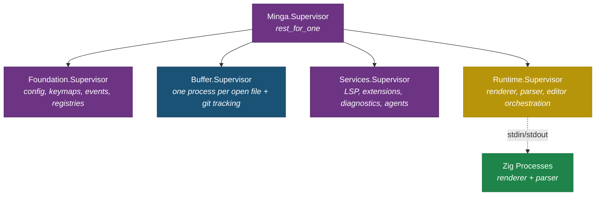
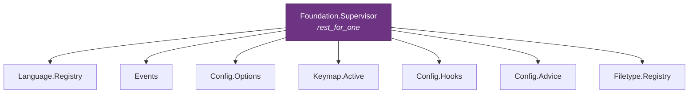
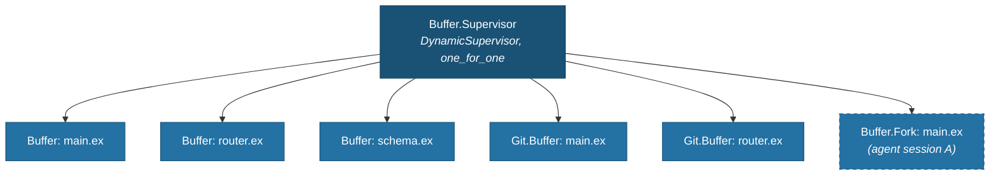
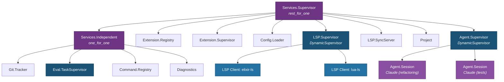
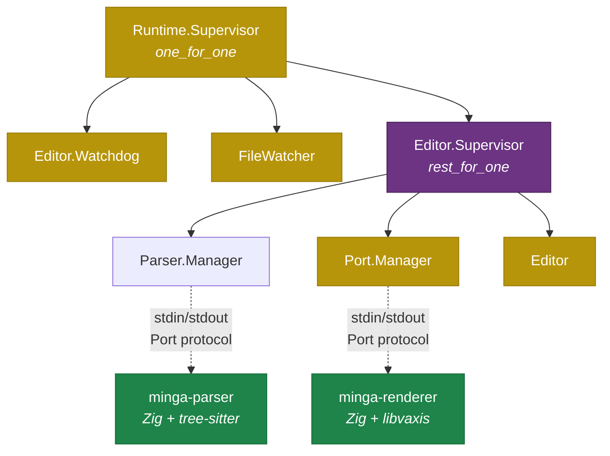
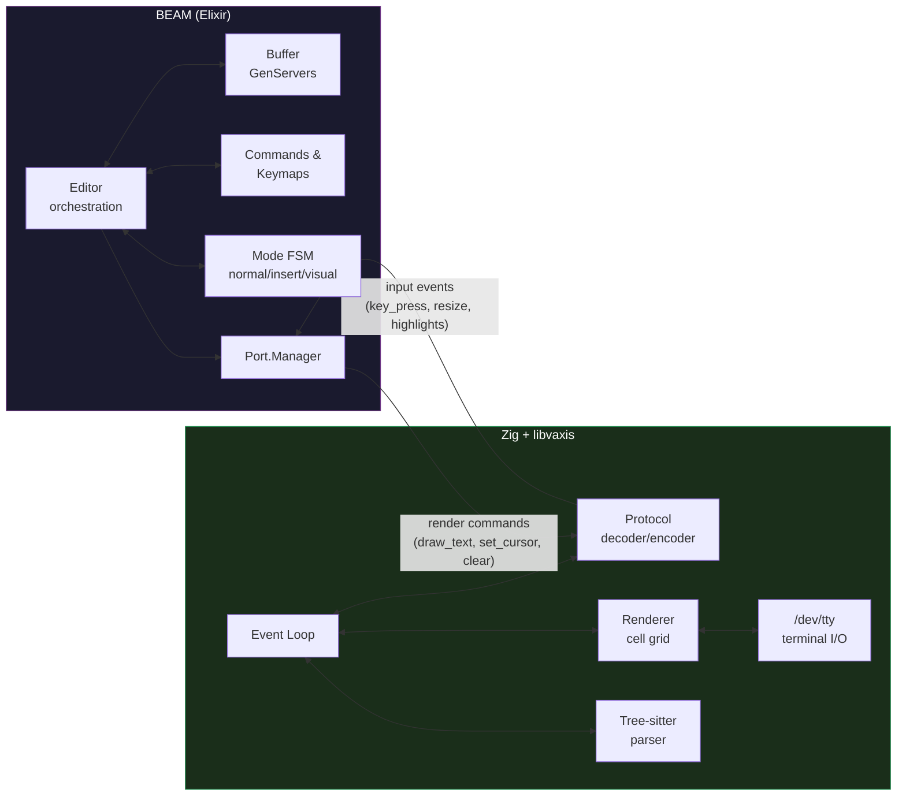
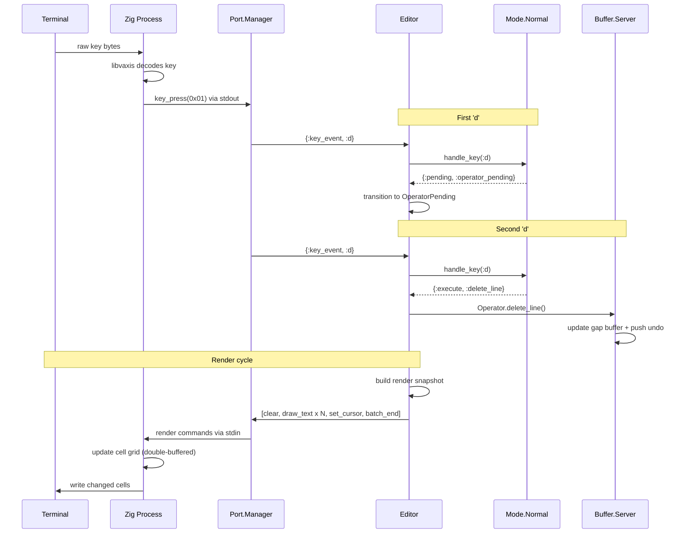
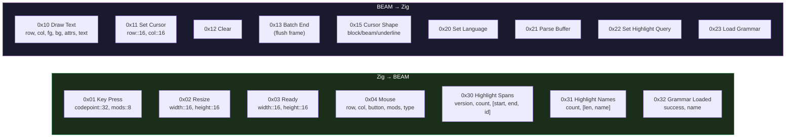
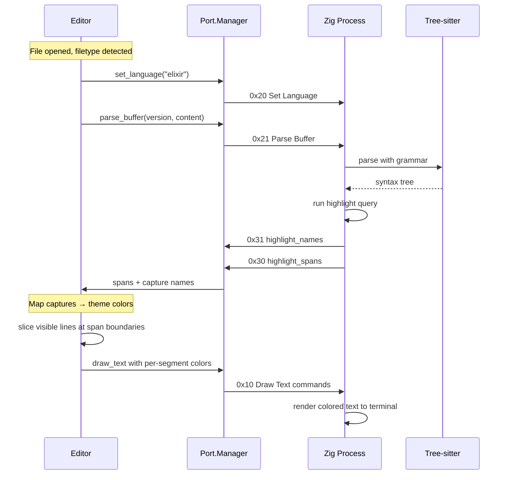
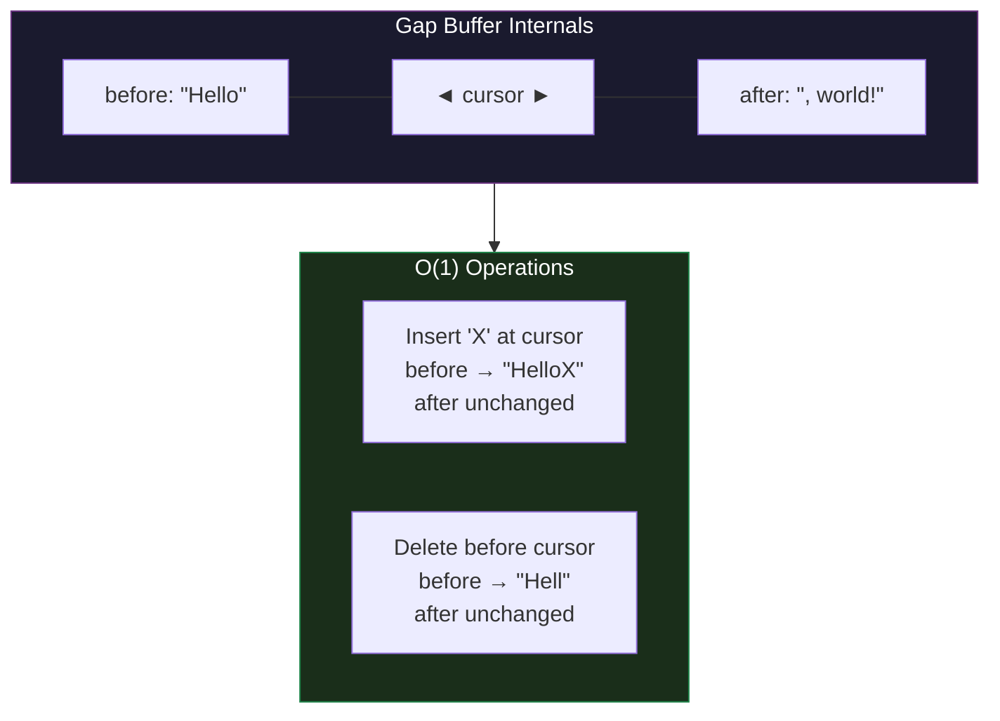

# Architecture Diagrams

Interactive diagrams of how Minga's processes, data, and communication are structured.

## Supervision Tree

The BEAM side of Minga uses nested supervisors to constrain blast radius. The top-level `rest_for_one` preserves the Foundation → Buffers → Services → Runtime cascade. Inner supervisors use strategies matched to their children's actual dependency profiles.

### High-level overview

Four tiers, each isolated. A crash in one tier doesn't cascade sideways.

### Foundation tier

Stateless registries and configuration that everything else depends on. These rarely fail.

### Buffer tier

One process per open file, plus per-buffer git tracking. `one_for_one` means each buffer is independent: one crashing doesn't affect any other.

> **Note:** `Buffer.Fork` processes (dashed border) are planned. See [Buffer-Aware Agents](BUFFER-AWARE-AGENTS.md#phase-2-buffer-forking-with-three-way-merge).

### Services tier

Higher-level features that depend on Foundation and Buffers. A git tracking crash restarts only Git.Tracker. An LSP server crash restarts only that client.

### Runtime tier

The tightly-coupled trio that handles rendering and user interaction. If the Port Manager (renderer) fails, the Editor restarts too since it depends on the renderer. Buffers stay untouched.

## Two-Process Architecture

Minga splits into two OS processes with completely isolated memory. The BEAM handles all editor logic; the Zig process handles terminal I/O and syntax parsing.

## Life of a Keystroke

What happens when you press `dd` (delete a line) in normal mode. The entire round-trip takes under 1ms on the BEAM side.

## Port Protocol

Length-prefixed binary messages over stdin/stdout. Each message is a 4-byte big-endian length, a 1-byte opcode, then opcode-specific fields.

## Syntax Highlighting Pipeline

Tree-sitter runs in the Zig process. The BEAM controls what to parse and how to color it; Zig does the actual parsing and returns highlight spans.

## Buffer Architecture

Each buffer wraps a gap buffer: two binaries with a gap at the cursor. Insertions at the cursor are O(1).

