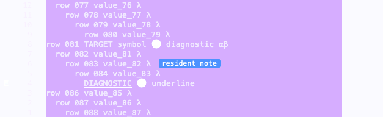
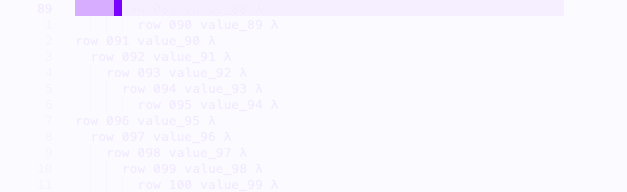

# Resident semantics performance and presentation evidence

This report records comparative performance measurements and renderer evidence for resident semantic data during frontend-local scrolling. It compares the previous viewport-bound path with the measured resident semantics implementation on the same machine and runtime.

## Environment and method

- Hardware: Apple M1, 16 GiB memory
- Operating system: macOS 26.6.1, arm64
- Runtime: Elixir 1.20.3, OTP 29.1.1, ERTS 17.1, eight online schedulers
- Build environment: `MIX_ENV=test`
- Inputs: 120, 1,200, and 65,000 source lines with varied indentation (`String.duplicate("  ", rem(i, 5))`), a 12-row viewport starting mid-document, and wrapping disabled; no-edit, backend scroll, and one-row edit scenarios
- Warm statistics: 12 samples per line-count and scenario pair; p95 uses the nearest-rank method
- Raw sanitized measurements: [`before.json`](before.json) and [`after.json`](after.json)
- Measured `lib/minga/search/index_owner.ex` SHA-256: `1bec786e887b3ed3896b4db0fb03a57ac35fc25d827ea4c8b70484d90c15f7a9`

Cold arming and keyframe promotion intentionally build complete resident coverage, so their work grows with the resident row count. The no-ack frontend draw does not invoke the BEAM. When the BEAM renders a scroll acknowledgment, the warm scroll path fetches the 12-row presentation slice and rasterizes zero rows. Warm no-edit frames also fetch the presentation slice from the retained store. An ordinary edit fetches and rasterizes the affected row plus the bounded presentation slice. This is the required cold O(n), bounded warm shape.

The source harness also records persistent resident-store counters. Those counters can describe retained state from an earlier build, so they are not evidence of work performed by a warm frame. The bounded-work statements below use current-frame line fetches, rasterized rows, hydration counts, row payloads, splices, and emitted bytes.

Process memory values are point-in-time BEAM process measurements. Negative deltas are valid after collection. The harness does not provide reliable garbage-collection counters, so this report makes no allocation or garbage-collection claim.

Timing samples are noisy and do not establish a speed improvement. The comparison establishes the bounded work shape and records the cost of the additional semantic payload.

## Warm timing and resource summary

Each table cell is `median/p95`. Times are microseconds. Memory and byte fields are bytes. Command bytes come from the production encoder and already include opcode `0xA9`; they exclude outer transaction framing. Semantic term external size is the BEAM serialization size of the model, not a wire payload, and is not added to command bytes.

### Before

| Lines | Scenario | Prepare | Scroll | Builder | Receipt | Total | Reductions | Process memory delta | Command bytes | Semantic term external size |
| ---: | :--- | ---: | ---: | ---: | ---: | ---: | ---: | ---: | ---: | ---: |
| 120 | no_edit | 123/4607 | 61.5/249 | 84/289 | 3/17 | 267/4879 | 5227.5/5275 | 960/21816 | 107/344 | 0/0 |
| 120 | scroll | 157.5/2785 | 57/227 | 77/274 | 3.5/14 | 330.5/3271 | 5188.5/5279 | 960/21816 | 107/344 | 0/0 |
| 120 | edit | 1995.5/10378 | 124/202 | 293/430 | 12/19 | 2457.5/10991 | 7694/8265 | 856/196896 | 384.5/397 | 0/0 |
| 1,200 | no_edit | 108.5/380 | 51.5/153 | 71.5/223 | 3/25 | 248/598 | 5032/5267 | 1120/1120 | 107/344 | 0/0 |
| 1,200 | scroll | 94/197 | 47.5/64 | 67.5/86 | 2/4 | 231.5/346 | 5032/5260 | 1120/1120 | 107/344 | 0/0 |
| 1,200 | edit | 717.5/1382 | 177/233 | 298.5/476 | 11/86 | 1271/1770 | 7711/8120 | 952/952 | 386.5/399 | 0/0 |
| 65,000 | no_edit | 211.5/8890 | 170/1132 | 89/277 | 4/17 | 474.5/9600 | 5050/5050 | 1120/1120 | 107/344 | 0/0 |
| 65,000 | scroll | 528/2847 | 288/575 | 125.5/380 | 7/16 | 1191.5/3278 | 5050/5050 | 1120/1120 | 107/344 | 0/0 |
| 65,000 | edit | 2206.5/3109 | 111/203 | 274.5/839 | 11/20 | 2621/3491 | 8562.5/11071 | 952/2.54543e+06 | 390.5/403 | 0/0 |

### After

| Lines | Scenario | Prepare | Scroll | Builder | Receipt | Total | Reductions | Process memory delta | Command bytes | Semantic term external size |
| ---: | :--- | ---: | ---: | ---: | ---: | ---: | ---: | ---: | ---: | ---: |
| 120 | no_edit | 90/279 | 47/214 | 66.5/194 | 2.5/32 | 212.5/628 | 5431/7102 | 976/196832 | 147/345 | 681/681 |
| 120 | scroll | 63.5/262 | 34/113 | 55/90 | 1/2 | 163/388 | 5391/5411 | 832/1120 | 147/345 | 681/681 |
| 120 | edit | 96.5/426 | 42/134 | 97.5/971 | 2/23 | 226.5/1222 | 9433.5/11369 | 800/317616 | 462/476 | 1291/1291 |
| 1,200 | no_edit | 72.5/106 | 44/51 | 50/81 | 1/3 | 166.5/222 | 5281/5447 | 1120/142656 | 147/345 | 684/684 |
| 1,200 | scroll | 79/214 | 39.5/76 | 51.5/72 | 1/2 | 176/321 | 5281/5460 | 1120/142432 | 147/345 | 684/684 |
| 1,200 | edit | 113/194 | 33/41 | 111/173 | 2/7 | 263.5/416 | 10024/10531 | 1264/142752 | 464/478 | 1327/1327 |
| 65,000 | no_edit | 80/333 | 119/616 | 60/182 | 2/6 | 278/1138 | 5329/5329 | 1120/1120 | 147/345 | 684/684 |
| 65,000 | scroll | 74.5/315 | 126.5/604 | 56/229 | 1/16 | 275/1166 | 5329/5329 | 1120/1120 | 147/345 | 684/684 |
| 65,000 | edit | 1594/4331 | 102/255 | 220/448 | 8/20 | 2086.5/4873 | 10670.5/10912 | 1272/2.54424e+06 | 468/482 | 1327/1327 |

## Warm current-frame work

Each cell is `median/p95 [minimum..maximum]` across the 12 warm samples.

### Before

| Lines | Scenario | Lines fetched | Rows rasterized | Full hydrations | Row payloads | Resident rows spliced | Row delta bytes |
| ---: | :--- | ---: | ---: | ---: | ---: | ---: | ---: |
| 120 | no_edit | 12/12 [12..12] | 0/0 [0..0] | 0/0 [0..0] | 0/0 [0..0] | 0/0 [0..0] | 108/108 [108..108] |
| 120 | scroll | 12/12 [12..12] | 0/0 [0..0] | 0/0 [0..0] | 0/0 [0..0] | 0/0 [0..0] | 108/108 [108..108] |
| 120 | edit | 1/1 [1..1] | 1/1 [1..1] | 0/0 [0..0] | 1/1 [1..1] | 1/1 [1..1] | 529/533 [525..533] |
| 1,200 | no_edit | 12/12 [12..12] | 0/0 [0..0] | 0/0 [0..0] | 0/0 [0..0] | 0/0 [0..0] | 114/114 [114..114] |
| 1,200 | scroll | 12/12 [12..12] | 0/0 [0..0] | 0/0 [0..0] | 0/0 [0..0] | 0/0 [0..0] | 114/114 [114..114] |
| 1,200 | edit | 1/1 [1..1] | 1/1 [1..1] | 0/0 [0..0] | 1/1 [1..1] | 1/1 [1..1] | 543/547 [539..547] |
| 65,000 | no_edit | 12/12 [12..12] | 0/0 [0..0] | 0/0 [0..0] | 0/0 [0..0] | 0/0 [0..0] | 114/114 [114..114] |
| 65,000 | scroll | 12/12 [12..12] | 0/0 [0..0] | 0/0 [0..0] | 0/0 [0..0] | 0/0 [0..0] | 114/114 [114..114] |
| 65,000 | edit | 1/1 [1..1] | 1/1 [1..1] | 0/0 [0..0] | 1/1 [1..1] | 1/1 [1..1] | 547/551 [543..551] |

### After

| Lines | Scenario | Lines fetched | Rows rasterized | Full hydrations | Row payloads | Resident rows spliced | Row delta bytes |
| ---: | :--- | ---: | ---: | ---: | ---: | ---: | ---: |
| 120 | no_edit | 12/12 [12..12] | 0/0 [0..0] | 0/0 [0..0] | 0/0 [0..0] | 0/0 [0..0] | 108/108 [108..108] |
| 120 | scroll | 12/12 [12..12] | 0/0 [0..0] | 0/0 [0..0] | 0/0 [0..0] | 0/0 [0..0] | 108/108 [108..108] |
| 120 | edit | 1/1 [1..1] | 1/1 [1..1] | 0/0 [0..0] | 1/1 [1..1] | 1/1 [1..1] | 529/533 [525..533] |
| 1,200 | no_edit | 12/12 [12..12] | 0/0 [0..0] | 0/0 [0..0] | 0/0 [0..0] | 0/0 [0..0] | 114/114 [114..114] |
| 1,200 | scroll | 12/12 [12..12] | 0/0 [0..0] | 0/0 [0..0] | 0/0 [0..0] | 0/0 [0..0] | 114/114 [114..114] |
| 1,200 | edit | 1/1 [1..1] | 1/1 [1..1] | 0/0 [0..0] | 1/1 [1..1] | 1/1 [1..1] | 543/547 [539..547] |
| 65,000 | no_edit | 12/12 [12..12] | 0/0 [0..0] | 0/0 [0..0] | 0/0 [0..0] | 0/0 [0..0] | 114/114 [114..114] |
| 65,000 | scroll | 12/12 [12..12] | 0/0 [0..0] | 0/0 [0..0] | 0/0 [0..0] | 0/0 [0..0] | 114/114 [114..114] |
| 65,000 | edit | 1/1 [1..1] | 1/1 [1..1] | 0/0 [0..0] | 1/1 [1..1] | 1/1 [1..1] | 547/551 [543..551] |

## Cold coverage

Cold promotion publishes complete resident text and semantic coverage. The table lists exact single-run promotion measurements from the measured implementation. Both arming and promotion measurements for before and after are retained in the raw JSON.

| Lines | Scenario | Lines fetched | Rows rasterized | Full hydrations | Total time (µs) | Command bytes |
| ---: | :--- | ---: | ---: | ---: | ---: | ---: | ---: |
| 120 | no_edit | 120 | 107 | 1 | 12051 | 7949 |
| 120 | scroll | 120 | 107 | 1 | 1620 | 7949 |
| 120 | edit | 120 | 107 | 1 | 2627 | 7949 |
| 1,200 | no_edit | 1200 | 1187 | 1 | 17886 | 78551 |
| 1,200 | scroll | 1200 | 1187 | 1 | 20019 | 78551 |
| 1,200 | edit | 1200 | 1187 | 1 | 18054 | 78551 |
| 65,000 | no_edit | 65000 | 64987 | 1 | 4578983 | 4463153 |
| 65,000 | scroll | 65000 | 64987 | 1 | 1838744 | 4463153 |
| 65,000 | edit | 65000 | 64987 | 1 | 1919269 | 4463153 |

## Semantic surface classification

- Indent guides: fixed. Compressed guide runs cover the complete resident range and update through bounded range replacements.
- Diagnostics, annotations, and selections: fixed. The retained semantic model stores absolute resident ranks and clients clip them to the local render slice.
- Search matches: retained row spans were already safe during local scrolling. The GUI source path now uses the source-owned search index with exact generation checks and bounded range queries, which fixes complete resident source coverage without a second search authority.
- Document highlights: baked row spans were already safe during local scrolling and required no new client computation.
- Cursor and cursorline: fixed. Eligibility is independent of the last committed viewport, while each frontend clips the absolute target to its local slice.

The Go input path also required a fix: a committed `reset_required` flag incorrectly blocked subsequent local wheel input. Reset reconciliation stays at frame commit; local scrolling is permitted once the resident store is ready. The regression uses the production window encoder shape.

## Renderer evidence

The screenshots come from the production protocol decoder, command dispatcher, retained resident stores, and Metal renderer. Only production frames 1 and 2 (arming and resident keyframe) were replayed. Each capture uses the same committed frame-2 snapshot at a different frontend-local offset, with no backend acknowledgement. The first capture at offset 76 shows off-viewport selection, search and document highlight spans, annotations, diagnostics, and guides after frontend-local scrolling. The second capture at offset 88 shows cursor and cursorline presentation after another local scroll.

## Protocol and behavioral coverage

- Protocol contract: [`docs/GUI_PROTOCOL.md`](../../GUI_PROTOCOL.md), Resident Semantics opcode `0xA9`
- Resident incremental behavior: [`test/minga_editor/render_pipeline/resident_incremental_test.exs`](../../../test/minga_editor/render_pipeline/resident_incremental_test.exs)
- Resident semantic state and rejection rules: [`test/minga_editor/render_model/window/resident_semantic_state_test.exs`](../../../test/minga_editor/render_model/window/resident_semantic_state_test.exs)
- GUI encoding: [`test/minga/frontend/adapter/gui/window_encoder_test.exs`](../../../test/minga/frontend/adapter/gui/window_encoder_test.exs)
- Search owner exact-generation and bounded-query behavior: [`test/minga/search/index_owner_test.exs`](../../../test/minga/search/index_owner_test.exs)
- Search index edit behavior: [`test/minga/editing/search/index_test.exs`](../../../test/minga/editing/search/index_test.exs)
- Go retained-state presentation: [`go/tui/internal/ui/resident_semantics_test.go`](../../../go/tui/internal/ui/resident_semantics_test.go)
- Swift retained-state presentation: [`macos/Tests/MingaTests/RendererResidentSliceTests.swift`](../../../macos/Tests/MingaTests/RendererResidentSliceTests.swift) and [`macos/Tests/MingaTests/ResidentRowStoreTests.swift`](../../../macos/Tests/MingaTests/ResidentRowStoreTests.swift)

## Live application evidence

The launched native app received only production frames 1 and 2 while its input stream remained open. Wheel input exposed rows 77–88 with selection, guides, search and document spans, the annotation, and diagnostic underline. Further scrolling exposed row 89 with cursor and cursorline. Returning to rows 1–12 produced a clean surface with no ghosts.

The launched Go terminal client repeated the same held-frame sequence after fixing the reset gate. Its captured terminal surface shows [rows 77–88](go-offset76.txt), [rows 89–100](go-offset88.txt), and a [clean return to the top](go-return-top.txt). The corresponding raw ANSI surfaces retain styling: [offset 76](go-offset76-screen.ansi), [offset 88](go-offset88-screen.ansi), and [return to top](go-return-top-screen.ansi).

A real BEAM-backed native session opened the disposable public fixture with the final source and freshly built app. Its first paste, automatic idle display, undo, redo, scroll to rows 84–120, and return to the top preserved guides and source attachment without manually requesting a repair frame. No protocol rejection or crash appeared in the runtime log.

A second real native run first scrolled to rows 42–78, placed the cursor on indented row 63, and inserted `Y` at column 5 after four leading spaces. The immediate edit frame retained its surrounding guides. A measured 2.0-second idle with no input or repair request kept the same row, viewport, guides, cursor, and cursorline. Undo removed the character and redo restored it at the same middle viewport. This observation used the exact newly built app path.
