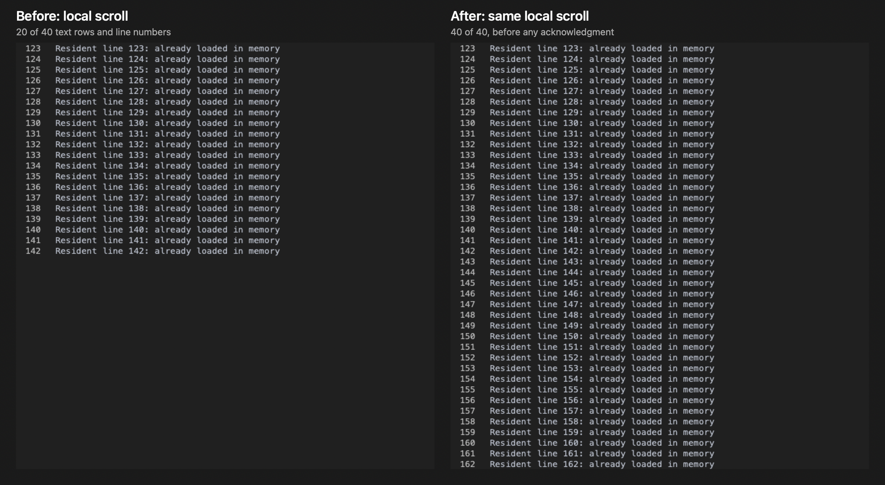

# macOS scroll presentation

The synthetic Metal readback below scrolls a fully resident 1,000-row document by 22 rows from anchor 100 in a 40-row viewport. Both captures occur before any scroll acknowledgment or new document rows arrive. The regression test also verifies the reverse direction.

The old preparation range was `98..<142`, leaving only 20 text rows and 20 numbered rows on screen. The fixed range is `120..<164`, filling all 40 rows. Preparation remains bounded to the viewport plus two rows at each edge, with one additional row when a fractional offset exposes both partial edge rows.

## Preparation performance

Three alternating baseline/fix pairs used the optimized production harness on the same machine (macOS 26.6.2, Apple Swift 6.4). Each run used five batches, 200 warmup iterations and 1,000 measured iterations per batch, with 65,536 resident rows and a 160-row viewport. Baseline: `a27270b88`. The clipping implementation now scans only through the viewport's right edge instead of constructing a character map for the entire line.

| Thread CPU time | Baseline median p50 | Fixed median p50 | Reduction |
| --- | ---: | ---: | ---: |
| Row command preparation | 0.089584 ms | 0.073083 ms | 18.4% |
| Decode, apply and preparation | 0.100916 ms | 0.084208 ms | 16.6% |

[Aggregate measurements](preparation-comparison.json). These are CPU preparation measurements, not frame-rate measurements. After committing the fix, reproduce the paired gate with `scripts/bench_render_performance_ab a27270b88 HEAD`.

The native regressions are `ContentViewTests.scrollEchoPreservesPresentation`, `ContentViewTests.wheelReconciliationUsesRenderedAnchor`, `ContentViewTests.windowedScrollRespectsPayload`, `RendererResidentSliceTests.localViewportPreparation`, and `TemporalOffscreenMetalTests.residentScrollFillsViewport`. They cover echo ordering, authoritative resets, pane ownership, unavailable windowed rows, bounded preparation, and actual text/gutter pixels.

## Complete Metal renderer

The standard three-sample native gate passed on Apple M3 Pro. All 720 measured frames completed, with no discarded frames and no new tracked Metal resource allocations after warmup. Median draw CPU p95 was 0.215 ms. Completion-time p95 samples were 9.274 ms, 5.385 ms, and 3.977 ms; the first sample exceeded the 8.33 ms budget, while the gate's three-sample median was 5.385 ms and passed. These measurements use the current benchmark's `MINGA_SNAPSHOT_RENDERER MINGA_TRANSCRIPT_ACCOUNTING` compilation conditions.

This reproduction uses unwrapped resident rows. The pre-existing logical-line reconciliation for wrapped/folded local scrolling is a separate limitation.
