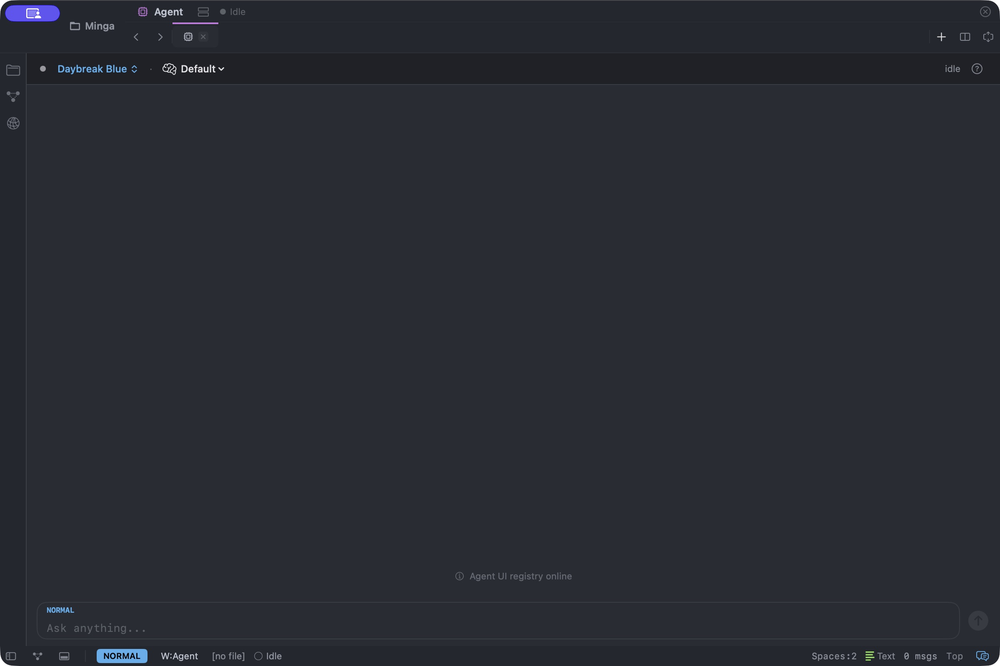
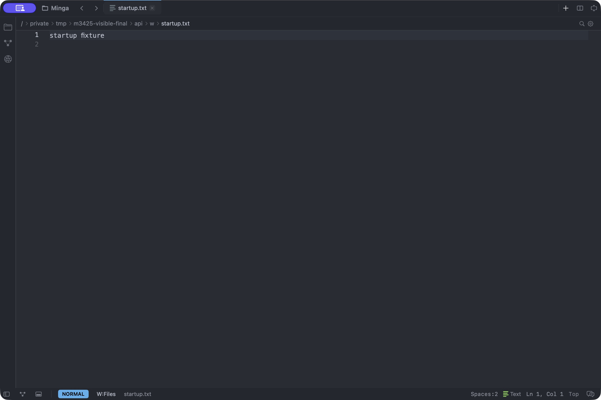
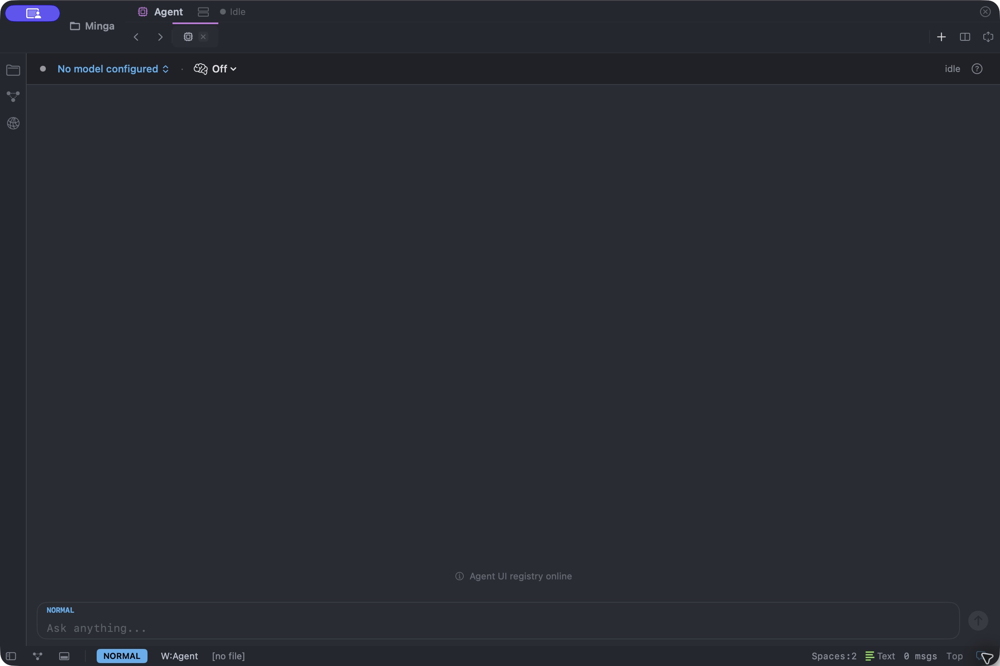

# GUI startup measurements for #3425

Ordinary file startup presents the configured editor and accepts a verified edit sooner after removing optional model discovery from the critical path.

## Scope and endpoints

The comparison uses 20 fresh-process/fresh-profile launches and 20 fresh-process/reused-profile launches per revision, alternating baseline and candidate order at each sample index. Both apps are optimized, self-contained Release bundles built with the same toolchain. The baseline is `0b402557fe2dfa17a61f6f05ff880b470a506e6c`, with only the retained instrumentation patch applied. `environment.json` records the candidate production diff hash, hardware, power, toolchain, and cache conditions. No OS caches were evicted. These are profile-cold and profile-warm results.

Each fixture isolates HOME, XDG directories, working directory, temporary files, and a short private IPC directory. A whitelist removes inherited provider and OAuth environment inputs. The file contains `startup fixture\n`; configuration selects Doom One. The first displayed frame is the first `MTLDrawable.presentedTime > 0`, not a render dispatch, committed frame, or callback timestamp. Dropped drawables with zero presentation time do not qualify.

After presentation, an observer sends `i`, `X`, and Escape through the Editor's input dispatch and uses a synchronous state barrier to verify `Xstartup fixture\n` and the configured theme. Launch-to-edit includes the 50 ms presentation poll, 10 ms observer poll, and 25 ms receipt poll. The separate dispatch metric measures only input dispatch through the barrier and buffer verification. RSS is the aggregate native app and recursive child resident memory sampled every 50 ms through presentation, not total system memory or an exact allocation peak.

## Distributions

| Profile | Metric | Baseline median / p95 | Candidate median / p95 |
|---|---|---:|---:|
| Profile-cold | Actual presentation | 6312.5 / 6366.2 ms | 2897.8 / 2942.3 ms |
| Profile-cold | Launch to verified edit | 6415.5 / 6486.0 ms | 3018.9 / 3067.9 ms |
| Profile-cold | Action plus observer polling | 82.5 / 89.9 ms | 87.4 / 90.8 ms |
| Profile-cold | Input dispatch through verification | 56.0 / 63.3 ms | 58.9 / 68.0 ms |
| Profile-cold | Sampled startup RSS | 1079.2 / 1108.8 MiB | 242.2 / 243.1 MiB |
| Profile-warm | Actual presentation | 6310.1 / 6380.2 ms | 2912.1 / 2952.0 ms |
| Profile-warm | Launch to verified edit | 6444.4 / 6517.5 ms | 3031.2 / 3076.5 ms |
| Profile-warm | Action plus observer polling | 69.1 / 98.4 ms | 87.2 / 97.7 ms |
| Profile-warm | Input dispatch through verification | 54.4 / 56.5 ms | 59.6 / 65.4 ms |
| Profile-warm | Sampled startup RSS | 1082.5 / 1112.1 MiB | 242.4 / 244.4 MiB |

The dispatch median is up to 5.2 ms higher in the candidate, within the overlapping observed sample ranges (about 46 to 74 ms). The end-to-end action median and p95 differ by at most 18.2 ms. This change reduces waiting before presentation; it does not claim faster editing.

## BEAM stages and native overlap

The BEAM timer starts at `Application.start`; its total excludes earlier native/VM boot and actual presentation. Individual stage values are intervals, not cumulative process-launch timestamps.

| Profile | Metric | Baseline median / p95 | Candidate median / p95 |
|---|---|---:|---:|
| Profile-cold | Extension startup interval | 1445.0 / 1462.3 ms | 1429.2 / 1463.0 ms |
| Profile-cold | Editor initialization | 3422.1 / 3443.7 ms | 44.9 / 50.7 ms |
| Profile-cold | BEAM timer total | 5168.8 / 5201.5 ms | 1764.6 / 1812.0 ms |
| Profile-warm | Extension startup interval | 1459.4 / 1478.7 ms | 1454.0 / 1478.3 ms |
| Profile-warm | Editor initialization | 3418.6 / 3437.9 ms | 45.5 / 47.4 ms |
| Profile-warm | BEAM timer total | 5174.1 / 5216.5 ms | 1782.4 / 1808.4 ms |

The baseline spawns its child about 6.2 ms after the AppStartup marker. The candidate spawns at about 0.9 ms, before font and Metal setup; Metal setup alone takes about 3.2 ms. The raw phase timestamps show the child has started while independent native preparation continues. Protocol reading remains after consumer installation, and port ready still comes from real view geometry.

Every baseline sample records one `LLMDB.models/0` entry and one `LLMDB.Catalog.lazy_load/0` entry in the Editor process through the first verified edit. These two trace entries describe one catalog load. Every candidate sample records zero entries. The dominant benefit is avoided catalog initialization; the native overlap gain is only a few milliseconds on this hardware.

The remaining extension interval motivates [#3462](https://github.com/jsmestad/minga/issues/3462), which validates portable shipped-extension artifacts before changing release assembly or admission. This PR preserves extension policy discovery, isolated user-source compilation, bounded validation, source admission, and generation sealing.

## Functional fixtures and first use

`functional.json` retains separate Release checks for a small file, an explicit local model, supported API credentials, OAuth-only credentials, and an agent-first launch. Ordinary file fixtures have no catalog entry through their first edit and configured save binding. The explicit `ollama:llama3.2` value is preserved immediately; no local inference server or network request was required for this presentation check. Resolver tests additionally cover selecting and restoring explicit local routes and credential-free custom endpoints.

| Fixture | First activation / inspection | Subsequent picker | Result |
|---|---:|---:|---|
| API-key after editing | 3507.6 ms | 84.0 ms | Exact route installed, provider started, picker ready |
| OAuth-only after editing | 4091.6 ms | 81.5 ms | Exact route installed, provider started, picker ready |
| Agent-first | 3401.1 ms | 87.1 ms | Exact route installed, provider started, picker ready |

These are single functional first-use observations with polling, not 20-sample latency distributions. Agent-first committed its initial native frame at 2786.4 ms and then spent 3401.1 ms completing its first inspection while model discovery ran. This committed-frame marker is not an actual-presentation measurement.

API-key and OAuth inputs are synthetic fixture values, not live account credentials. No network prompt is submitted in these native launch checks. API and OAuth routes have distinct exact selection identities. Both install their model before the native provider starts. Agent-first startup is reported separately: its initial committed frame is outside the Metal buffer timer, and its first inspection waits for agent discovery. It is not part of the file-startup distributions. `agent_first_gui.json` and the screenshot verify the SwiftUI surface separately: the resolved model is Daybreak Blue, reasoning is Default, and normal quit leaves no owned child.



The no-credentials resolver check returns an empty candidate list without acquiring catalog data, including when favorites exist or an unsupported credential is present. Implicit Ollama discovery is excluded; explicit local models, exact saved/current routes, and configured custom endpoints remain available. Pending resolution stays `:checking`; confirmed absence becomes `:unconfigured`. A model sentinel alone does not establish missing credentials.

`empty_gui.json` records a visibly presented native launchpad, Doom One, native `i E Escape` editing, a native save command with exact saved content, and Cmd-Q with no remaining owned processes. `no_credentials_gui.json` also records native agent activation and an empty model picker with no catalog entry, followed by a clean Cmd-Q. Screenshots retain the observed native surfaces.



 The launchpad and agent view use SwiftUI, so a missing Metal drawable timestamp on those surfaces does not mean no UI was presented.

`functional_baseline.json` repeats the ordinary file fixtures on the baseline. Single-smoke presentation times are 6158.4 ms (no credentials), 2920.0 ms (explicit Ollama), 6243.5 ms (API-key), and 6245.9 ms (OAuth-only). Corresponding candidate observations are retained in `functional.json`. Explicit Ollama already bypasses the baseline catalog load and remains near 2.9 seconds. These smoke observations verify fixture behavior; the controlled distributions above establish the reported speedup.

Deterministic checks cover constructor and activation boundaries, custom status projection, readiness events before port ready, stale-session routing, the first edit, exact route handoff, default reasoning policy preservation, valid explicit overrides, rejected unsupported overrides, and initial Session snapshot projection without replaying activation notifications. Initial attachment, tab hydration, and reconnect share this projection. The native provider executes an exact selection unchanged; direct callers must put its reasoning policy in the selection rather than also supplying a raw `thinking_level`. Legacy unresolved-model startup still accepts an optional explicit override. Existing native provider prompt tests and Session recovery tests verify first-prompt and later-credential behavior without network calls.

## Owned-child failure checks

`native_failures.json` records actual app launches with one child spawn each, app exit, no committed frame, and no surviving owned child for renderer initialization failure, immediate child exit, and quit during startup. `reconnect.json` records the old child's actual exit and a second child after accepting the existing Restart Editor recovery alert. Recovery remains responsive and does not claim an automatic restart without that alert.

To reproduce failures, copy the candidate bundle to a disposable fixture directory and keep the same isolated launch environment as the harness. Remove that copy's `.metallib` files for renderer failure, or replace that copy's `Contents/Resources/release/bin/minga_macos` with an executable shell script that exits zero for immediate child exit. Re-sign the modified copy with `codesign --force --deep --sign - --options runtime --entitlements macos/Entitlements.plist <fixture>/Minga.app`. For startup quit, add a config observer that waits for `Process.whereis(MingaEditor)` and sends the `:q!` key sequence before port readiness. Observe `BEAM started (pid ...)`, wait for that PID's actual exit, and reject multiple starts or surviving children. Never modify the installed app or signal a user editor.

For reconnect, launch an owned fixture, terminate only the BEAM PID emitted by its process manager, accept Restart Editor in its recovery alert, verify the replacement child and visible editor, and quit that owned app. Swift tests separately cover pipe close-once behavior, partial connection initialization, queued writer retirement, child abort, immediate exit, and startup activity cleanup when `Process.run()` throws.

## Reproduction

Use the repository-pinned toolchain and normal Release assembly. From a Minga checkout, create a baseline worktree at the recorded base, apply the instrumentation patch retained here, and run `make release-mac`. In the candidate worktree, run `make release-mac`. Copy each app from the path printed by assembly to separate disposable directories. Keep their normal bundle identifiers and executable names. The harness disables AppKit's unknown-argument file-open behavior with `-NSTreatUnknownArgumentsAsOpen NO`.

```sh
scripts/create_worktree perf/3425-measure-baseline 0b402557fe2dfa17a61f6f05ff880b470a506e6c
# In that baseline worktree:
git apply <candidate-worktree>/performance/results/gui_startup_3425/baseline-instrumentation.patch
make release-mac
# In the candidate worktree:
make release-mac
python3 -m venv /tmp/minga-startup-venv
/tmp/minga-startup-venv/bin/pip install psutil==6.0.0
/tmp/minga-startup-venv/bin/python bench/gui_startup.py --baseline /tmp/baseline/Minga.app --candidate /tmp/candidate/Minga.app --output /tmp/minga-startup-results --samples 20
```

The output directory must not exist. `raw.jsonl` retains every accepted sample, `summary.json` contains median and nearest-rank p95 (sample 19 of 20), and `excluded.jsonl` records rejected attempts. Concurrent native/parser/TUI builds cause rejection and retry; any other failure stops the run. All measured apps and children must exit before the next fixture. Configured save binding and API/OAuth activation checks are retained separately from timed first-edit samples.

## Validation

- `make lint`: format, Credo, ExDNA, compile warnings-as-errors, Dialyzer, and Reach passed. Set the process file-descriptor limit to 4096 for the local Dialyzer run.
- `mix test.llm`: 58 doctests, 100 properties, 10,675 tests, zero failures, one skip, and 655 excluded tests.
- Focused native-provider, Session recovery, resolver, and UI-state checks: 158 tests passed, including the heavy first-prompt provider tests. The final snapshot, concurrent-session, recovery, and catalog-boundary checks passed 59 tests.
- `mix swift.build`: passed. Applicable `xcodebuild test` with the Debug Minga scheme and code signing disabled: 1,517 tests in 192 suites passed. Swift sources did not change after these receipts.
- `make release-mac`: passed with the final production source tree.
- `git diff --check` and Python harness execution passed.

The results describe this machine and fixture. They do not establish a universal startup target, an OS-cold launch, authenticated network completion, or SwiftUI presentation latency. Timing and tracing are opt-in with `MINGA_STARTUP_TIMER=1`; unit tests use behavior and traces rather than elapsed-time thresholds.
